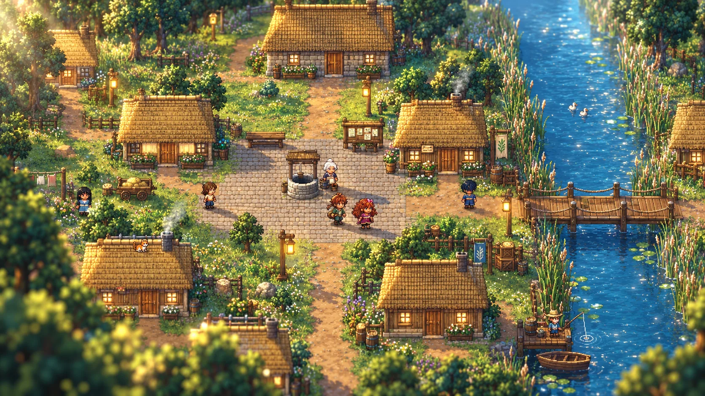
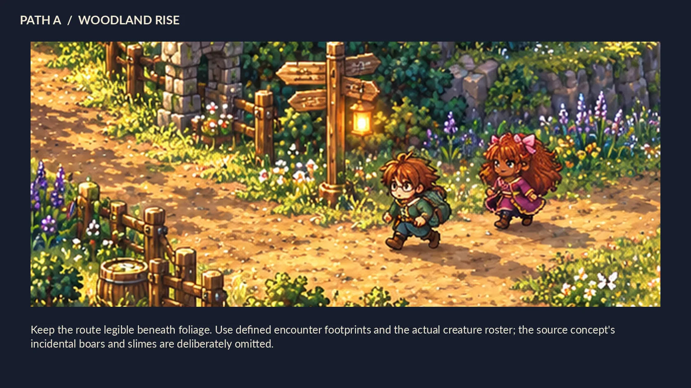
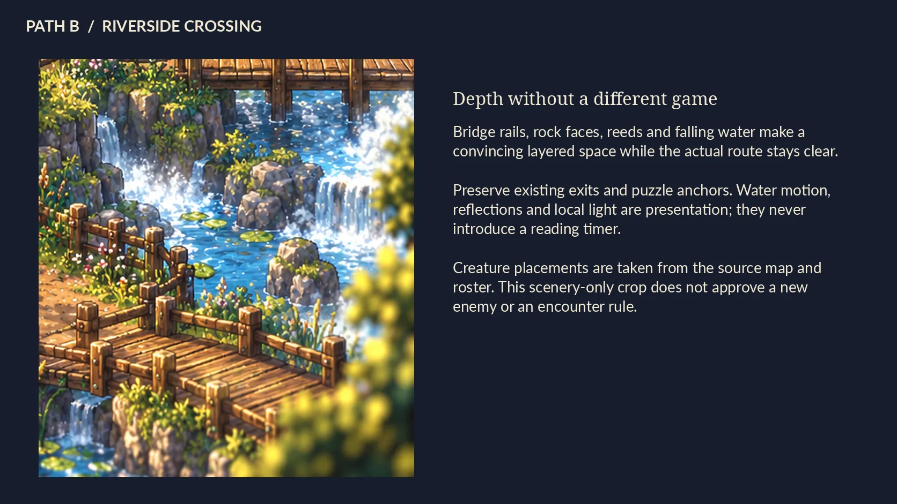
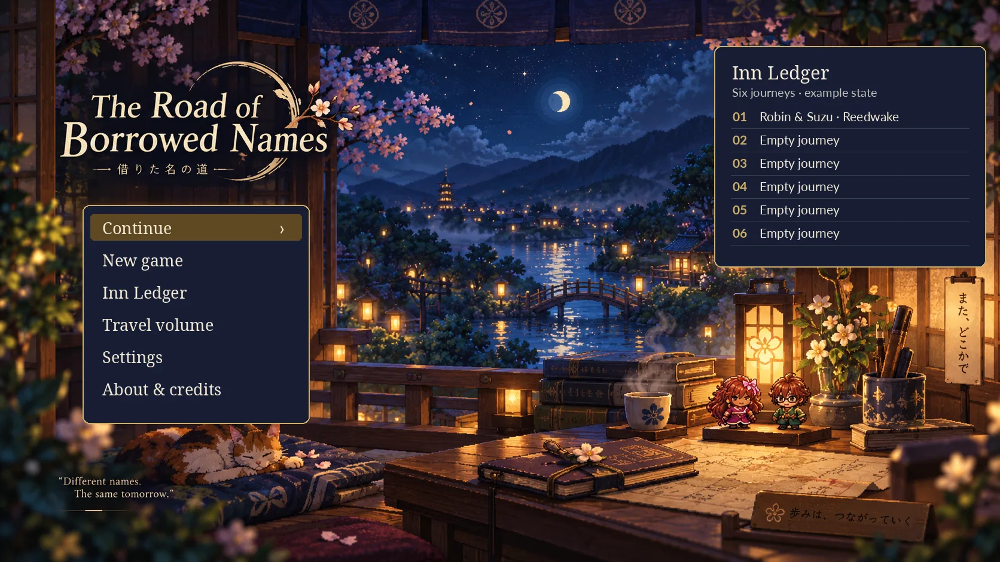
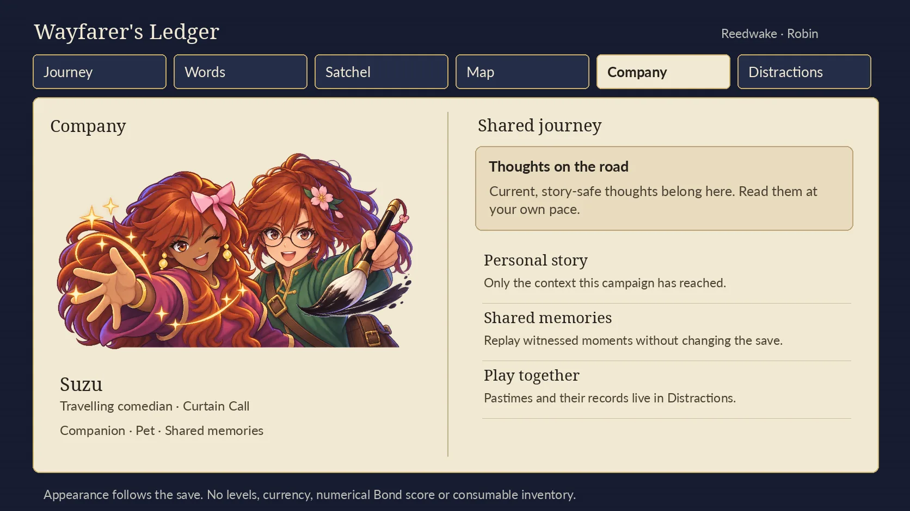
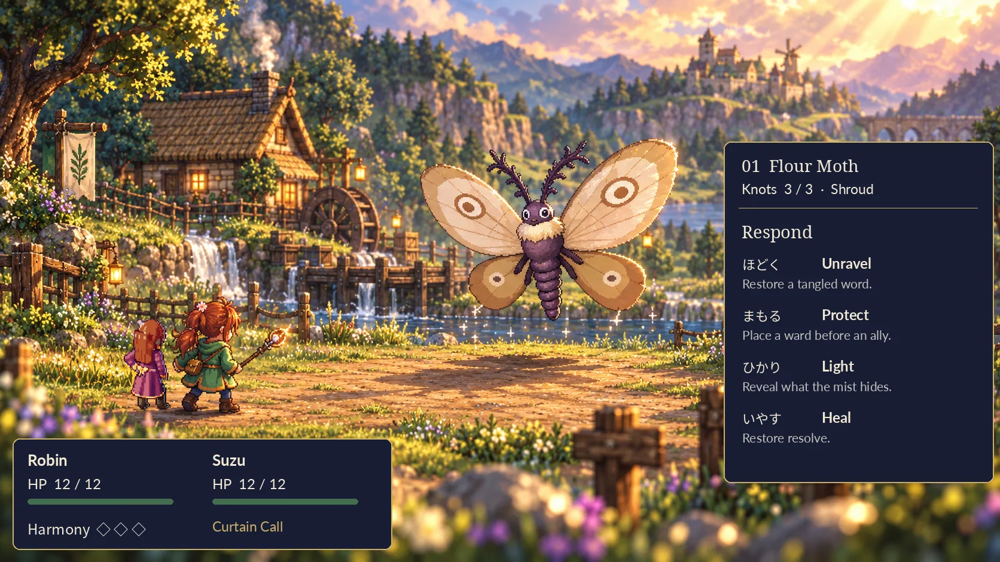
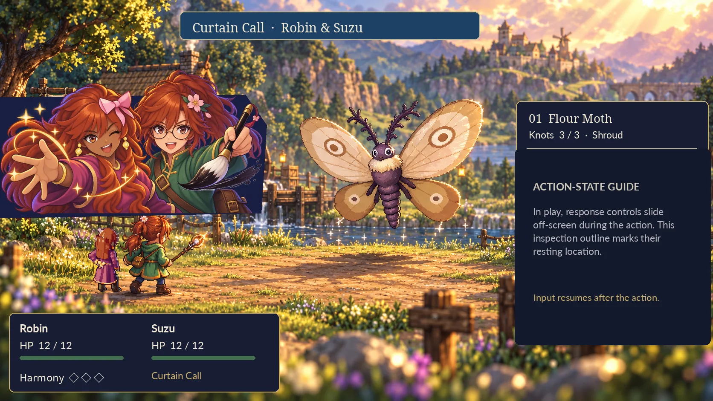
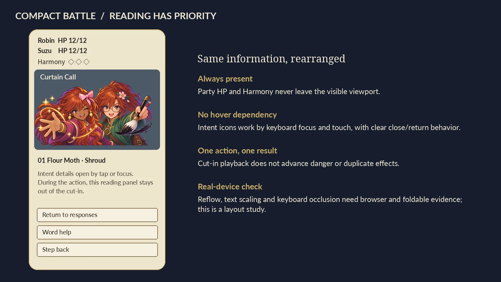

# The Road of Borrowed Names
## Single-model expansion & art implementation playbook

**Production plan v1.2 · UI direction, confirmed decisions and font permission · Prepared for Robin**  
**Basis:** *Borrowed Names Expansion Plan.md*, draft 7 (8 October 2026), plus Robin's later C-72–74 approval, physical-book UI direction and font permission.  
**Destination:** a complete twelve-chapter edition, its expanded postgame, and a cohesive painterly-pixel 2.5D presentation.

> **The central recommendation:** establish and prove the shared visual construction method before multiplying new content. Build the expansion on that method. Complete the exhaustive art pass after the content is stable. One single-model implementation owner carries the work through all three stages.

This is a proposed execution plan, not a claim that any game implementation, repository audit, performance measurement or playtest was performed while preparing this document. Producing this plan does not itself authorize product changes or publication. The attached draft remains the baseline content specification, subject to Robin's later explicit decisions recorded in §00; this document supplies sequencing, engineering contracts, art production, verification and completion criteria. Its mockups are inspection references, not screenshots of a working new renderer.

## 00 · Revision 1.2 — read before implementation

**What changed:** Robin approved C-72, C-73 and C-74 “as asked” and asked for the final interface pass to feel like a physical, authored travel book rather than generic nested panels. This revision preserves those approvals and §15A, and records the later permission for a readable, tone-appropriate new font. It retains the full expansion, all 118 source features, 19 execution milestones and the original ten visual plates.

| Decision | Current status and exact scope | Effect on work |
| --- | --- | --- |
| C-72 | **Approved as asked.** The eleven modifier families, tradeoffs, natural-phrase restrictions, learning/discovery placement and input-evidence treatment in draft 7 E27 / C-72 stand. | Remove the pending-confirmation gate for E27 and L17b; preserve language review and implementation tests. Game-specific effects are not universal Japanese definitions. |
| C-73 | **Approved as asked.** Do not add the proposed per-round enemy-group ceiling. Meet groups through the growing player/companion toolset and the source's solvability tests. | Remove that confirmation gate in E22. This does not remove the language-mistake cap, Relaxed guarantees, finite ordinary arrivals, summon capacity or other existing protections. |
| C-74 | **Approved as asked.** Two-target Unravel is a Chapter 4 story growth moment; party-wide Protect is a Chapter 7 story growth moment. | Use these placements in P09/P10 and the modifier prerequisites, rather than waiting for another answer. |

**Authority:** the latest user approval supersedes the three “Confirm” labels in the preserved draft 7 snapshot. It does not approve every unrelated discrepancy in §03, every optional proposal or implementation/publication outside the authorized scope. New-font permission is recorded separately below. Do not ask Robin to reconfirm these three decisions. Content approval, implementation status and testing status remain separate.

**Read efficiently:** read this section; §15A for the book, typography and interface requirements; the relevant P milestone; then the exact source feature and current code. The new U00–U07 packets refine P00/P01/P06/P16/P17; they are not a second development schedule or a new agent hierarchy. UI-A01–UI-A20 are additional presentation/interaction checks, not replacements for the 118 source features.

**Typography boundary:** Robin now permits a new font provided it is readable and stylized for the game's tone. This supersedes the font-file prohibition only; single-file offline delivery and no remote dependencies remain. No particular family is selected. UI-TYPE-01 is approved in principle; validate the chosen face, Japanese/ruby support, licence, packaging and fallback in U02.

**Visual references:** the new Journey/Company figures are user-supplied baseline screenshots, not replacement mockups. Earlier menu plates remain useful for information placement, but §15A now governs the menu's visual finish. Nothing in this revision claims a fresh game playtest, renderer implementation or final UI approval.

## 01 · How to use this package

### A plan that complements the source, rather than replacing it

Read §00 first, then this playbook with the unchanged source draft supplied in `source/`. The historical C-72–74 confirmation labels in that snapshot are superseded by Robin's approval. The source contains the complete feature descriptions and decision history. The execution register maps every numbered S, E, D, L, W, R, C and K feature to implementation work and evidence. The original sixty proposals remain traceable, including the two expressly excluded proposals. A feature is not dropped merely because this playbook groups it with another engineering task.

**Source references** use `[EP S4]`, `[EP C-54]`, or a named source section. `C-54` is a decision; `C14` is a culture feature. They are not interchangeable. Exact source line ranges appear in the feature register. `[ART]` refers to the supplied Harmony/player-sheet instructions. `[DIRECTION]` denotes Robin's newer visual direction and corrections in this conversation. `[RECOMMENDATION]` identifies a design or operational choice proposed here, not an already approved source requirement. `[W1]`–`[W3]` are the limited outside workflow references listed at the end.

The baseline source is draft 7, not whatever revision Claude may have locally when execution begins. Its claims about existing functions, counts, tests and fixed defects must be checked against the actual starting repository. Do not replay completed work merely because it appears in an older planning section. Equally, do not assume a source claim of “fixed” proves the current branch still contains the fix.

### Three kinds of authority

**Content authority:** Robin's latest explicit decisions, then the source's decision register and guardrails, then its proposed feature details. Existing story canon governs matters the expansion does not explicitly change. A new illustration never establishes a story fact.

**Execution authority:** the scope Robin subsequently authorizes, including this playbook's proposed sequencing amendments. Implementation may continue through ordinary tests, reversible corrections and checkpoints within that scope without repeatedly asking to do routine work. Changing a guardrail, interpreting a genuinely unresolved product decision or publishing a release still needs the appropriate approval.

**Visual authority:** the earlier standalone Reedwake and Saltglass images establish the desired warmth, depth and richness; the approved Harmony references establish character finish and identity. They do not approve the invented statistics, party sizes, enemies or inventories that appeared in some generated concepts. Preserve the actual cast and systems. For menus and text surfaces, the later physical-book direction in §15A supersedes earlier generic interface styling. [DIRECTION]

### What completion means

Completion is the intersection of **implemented behavior, integrated content, verified learning rules, finished presentation and accepted release evidence**. It is not a source-file count, a green unit suite, one full route, a beautiful still, or a coordinator's completion percentage.

Every approved feature must have: an implementation location; reachable content; relevant profile/companion variants; finished assets and animation; focused tests; integration evidence; and a recorded disposition for any remaining issue. Optional proposals that were never authorized remain explicitly outside the release scope, not silently marked finished. An outstanding required confirmation prevents the dependent feature from reaching release-ready status, but need not stop independent authorized work.

## 02 · Preserve the game being made

The expansion's north star is **Japanese as increasing agency**: understanding signs grows into explaining a plan, clarifying a misunderstanding, reconstructing an event and negotiating a workable arrangement. More maps and higher-fidelity art support that progression; they do not replace it. [EP Principles]

The twelve chapters are: **Reedwake; Saltglass; Manybridge—Eight Hundred Bridges; Manybridge—Blockprint and Footlights; Cinder Orchard; Snowbell; the Keepers' Road; Lanternfall; Kotonoha; the Cloudroad; Steamhollow; the Still Archive.** Existing chapter flags keep their original meanings, with a separate display-number map. The final resolution remains resolved; the postgame deals with lingering effects, discovery and rebuilding, not a replacement threat that invalidates the ending. [EP Story §§4–6]

### Non-negotiable experience rules

Reading, thinking, drawing, consulting help, fixing recognition, loading art and waiting for animation do not advance encounter danger. Only committed gameplay actions do; an explicit **Wait and watch** is an action. A cosmetic wind cycle must never become a gameplay timer. Opt-in recreational timers remain a deliberately separate exception with help-pausing rules.

Recognition error, language error and tactical choice are different events. Recognition uncertainty never commits an irreversible choice or causes damage. A genuine language error receives the established retry/support treatment. A tactically poor, understood and confirmed decision may change an encounter or an authored side outcome. No global correctness score controls damage, access or difficulty. Choice, typing and handwriting remain complete ways to play. Listening is optional.

There are **two permanent adventurers: the player and the chosen companion**, with a cosmetic pet if selected. Independent guests in an authored encounter are not extra controllable party members. Temporary story separations always return the same companion, cannot be caused by Japanese mistakes, and never permit a replacement fighter. No permanent loss of the player troupe, companion or pet. No level, experience, currency, random-loot or potion-hoarding system is introduced by an art mockup. [EP G1–G15; C-12; C-69; DIRECTION]

Bond never decreases. A disagreement ends in meaningful reconciliation, not resentment. Romance is limited to the source's optional, consensual adult hand-holding/kiss scenes, with an equally warm friendship response and identical Bond treatment. Suzu's expanded dream is a double act, fun and good company—not celebrity. Keep the existing personal quests and add the four second arcs at equal depth. [EP C-59, C-62, C-67, C-68]

### Technical boundaries

The distributed game remains **one offline HTML file**, with no network dependency, runtime AI, account, API key, CDN, external asset request or new runtime library. Source may remain modular; build tools assemble the distribution artifact. No user-facing save import/export, share codes, cloud saves or hidden substitutes. Development Git backups and test fixtures are not a player save-export feature. Preserve embedded-data notices and source licenses. Font-specific exception: Robin permits a new readable, tone-appropriate font. §15A/UI-09 governs selection and verification; embed any selected game font for offline use. This does not authorize remote fonts or unrelated dependencies. [EP Technical boundaries; S4–S8]

Use the current rendering/audio/input infrastructure where it meets the goal. A native browser API used by project-authored code is different from adding a third-party runtime, but still needs compatibility and policy review. This playbook does not silently authorize a new framework, a game-engine migration, workers prohibited by the existing policy, or a weakened content security policy.

## 03 · Proposed changes to the source's execution order

These are explicit recommendations to approve with this playbook. The unchanged source is not edited in this package.

| Amendment | Change proposed here | Why |
| --- | --- | --- |
| A01 · Visual foundations early | Add a bounded presentation proof before large new-region production. | Camera, scale, occlusion and attachment choices influence every later scene. |
| A02 · Animation contracts early | Establish pose, prop-contact, expression and transition conventions early; keep exhaustive drawing and line-tagging late. | Prevent each new scene inventing its own animation plumbing. |
| A03 · Compatible interim art | After visual approval, interim assets use the new conventions and reusable kits, even before final polish. | Avoid knowingly creating obsolete-format assets. |
| A04 · Edition release later | Treat the source's Phase 9 “edition ships” as an internal integration milestone; publicly ship the complete requested expansion plus art only after final gates. | The requested destination includes the postgame and art, not only six inserted chapters. |
| A05 · Continuous review | Language and performance reviews run throughout; their final phases close the remaining register. | They cannot safely be retrofitted after all content and artwork are committed. |
| A06 · Single-model execution | One active single-model writer, sequential review and deterministic tools; no other-model workers or mixed-model plan mode. | Matches this request and removes cross-agent ownership ambiguity. |

The source's full-playthrough gate remains. A separately authorized art proof may occur before the expansion is authorized, but no new content phase starts merely because the proof exists. Final art remains late; the construction rules it depends on move early. [EP Roadmap; A01–A06]

### Confirmed decisions and remaining source discrepancies

**C-72, C-73 and C-74 are approved as asked by Robin; see §00.** Record those decision dependencies as satisfied and carry the exact approved scope into the relevant packets. Do not leave stale “until confirmed” gates in E22, E27, L17b, P04, P09 or P10. Approval is not implementation or test evidence. The capped language-mistake cost is a different rule and is not removed by C-73.

The following issues require an explicit resolution record. Some are straightforward later-decision overrides; others need clarification. “Resolve” means record the conflicting passages, the chosen authority, what changes and the test—not silently substitute a preference.

| Issue | Source tension | Recommended handling |
| --- | --- | --- |
| D01 · Stale status wording | Hanafuda, Ledger names, spacing, music and gallery choices are decided in later tables but “if approved” survives elsewhere. | Apply the later recorded decision and log the editorial correction; do not ask Robin the same question again. |
| D02 · Mastery-derived stamps | K1 suggests stamps for mastery stars; L3/C-13 says stars unlock nothing, explicitly including stamps. | Recommend no mastery-star-dependent stamp. Block contradictory reward wiring until the precedence is recorded. |
| D03 · Festival rewards | K1 includes festival participation stamps; C-55/C10 says festival games keep personal records only. | Keep story/festival-completion records separate from game-score or mode rewards; document the participation-stamp disposition. |
| D04 · Crowded Harmony | E12 says cut-ins may disappear on small crowded layouts; C-42 permits brief overlap. | Recommend responsive overlay placement, not actor-count suppression; protect HP/Harmony and reading controls. |
| D05 · Actor count | “Up to five actors” is ambiguous about inclusion of the two permanent adventurers. | Specify the roster counted by the limit before implementing formation rules; use separate party and encounter-side capacity fields only if approved. |
| D06 · Unravel guarantee | E26 can silence Unravel until another response counters it, yet repeats “Unravel alone.” | Write the actual allowed-action predicate with Robin's existing combat contract. Report separate strict and counter-enabled tests; do not call one the other. |
| D07 · Exam completion | Retakes mention only assisted questions, while wrong first answers also fail qualification; the exact correct-answer aggregation is underspecified. | Define question eligibility and fresh retake rules before stars. Proposed aggregation is in §08, clearly not a new approved threshold. |
| D08 · Atlas adaptation | Generic expedition paragraphs freeze learning content; C-57 keeps adaptive practice inside fixed Atlas geometry. | Implement the explicit Atlas exception with separate topology, topic and practice-pool policies. |
| D09 · Illustration count | K2 still says ten chapters and about 60–70 pages after twelve chapters and new arc illustrations were added. | Rebuild an exact composition manifest; retain estimates as historical, not quotas or promises. |
| D10 · Chapter Journey | K6 tier 3 is still a proposal and describes keepsake carryover unlike the finalized NG+ rules. | Keep it a separate gated feature. Do not confuse it with ordinary read-only replay or silently implement it as NG+. |
| D11 · Hall resources and counts | R5 mentions persistent oil; D9 describes condition; a “delver chance” appears in a ten-trial mixture. | Define the actual resource manifest and ensure optional random meetings never stand in for a required trial. Do not add an oil inventory by accident. |
| D12 · Current defects | Audit says eight defects fixed; older “current state” sections still describe them as broken. | Confirm the starting commit and regression tests; retain fixes rather than rebuild them. |
| D13 · Companion meeting chronology | An older Manybridge paragraph suggests meeting Suzu's troupe there; the detailed arc places the reunion in Steamhollow. | Preserve the latest detailed arc's seed/contact versus reunion distinction; record the correction. |
| D14 · Counts and estimates | Creature targets, road counts, side-quest guidance and region estimates do not all add up. | Inventory actual entities and approved additions; reconcile per-region manifests without padding or silently dropping named content. |
| D15 · NG+ appearance | Appearance persists, while equipment and keepsakes do not. | Separate base creation appearance from earned wear; explicitly settle any incompatible saved look before carryover implementation. |
| D16 · Harmony charges | E18 and the roadmap retain decision language despite the three-confirmation dashboard. | Preserve the current one-technique behavior by default and record whether the existing decision already settles it; no invented charge system. |

There may be additional contradictions in the current repository. Add them to the same register. These observations are from the supplied draft, not a new live-code audit. A disputed choice blocks only the work that depends on it. Never lower the quality target or fabricate a later-story explanation to eliminate a blocker.

## 04 · A single-model operating method

### One owner, several sequential hats

The same single-model implementation owner performs **investigator → designer → implementer → reviewer → integrator** as separate steps. “Reviewer” does not mean a second model has independently verified the result. For a particularly risky change, a fresh, read-only single-model review context may inspect a checkpoint after the writer has stopped; this is optional, serial and still single-model. No parallel writers are required for this plan.

Use deterministic tools for compilation, linting, rule checks, screenshots, image dimensions, hashes, alpha masks, fixture replay and performance captures. They are tools, not delegated language-model authors. Previously supplied image references remain references; the plan does not depend on the implementation model acquiring an image-generation capability or on another model producing missing production art.

**Model selection:** at execution start, select an available, approved full implementation model identifier for the actual environment and record the resolved model. Avoid `default`, `best` and `a mixed-model plan mode` as a guarantee of single-model behavior: documented aliases can resolve differently, and `a mixed-model plan mode` switches to another model for implementation. Recheck after a resume or environment change; pause model-authored work if an unexpected fallback occurs. Use the environment's supported controls, not a guessed configuration file. This verification concerns the project authoring sessions; it is not a claim about undisclosed provider-internal services. [W1]

The procedure below is a project-specific recommendation. Anthropic's long-running-agent guidance supports persistent feature records, clean checkpoints and verification between sessions; it does not prove that any particular art target or completion date will be achieved. [W2]

### Start of an implementation session

Read the latest authorization, `STATE.md`, current task and decision register before touching the product. Confirm repository path, branch, HEAD, upstream state, dirty files, active task-owned processes, free disk space and the build/test entry points. Read the relevant source feature and current code, not the entire history indiscriminately. Preserve unexpected local changes; do not reset them away to obtain a convenient baseline.

Recover unfinished work from the last actual checkpoint. A historical commit mentioned in a handoff is an identity clue, not a reset target. Confirm that the implementation and its evidence refer to the same source revision. Refresh an old assertion before reporting it as current.

### The unit of work: an accepted vertical packet

A packet should complete one coherent behavior through model, content, interface and tests. For example, “procedure steps can be repeated without duplicate evidence” is preferable to “write half the procedure engine.” Keep one product packet in progress; a second queued packet can be ready, not concurrently edited.

Each packet records its objective, source IDs, dependency status, allowed files, state/API contracts, fixtures, prohibited shortcuts and acceptance evidence. Specify which existing tests must remain unchanged. Predict likely failure cases before implementation, but do not spend a session writing elaborate documents for a trivial change.

**Work loop:** reproduce or establish the baseline; add the focused assertion; implement the narrow change; run targeted checks; render and inspect where visual; challenge edge cases; integrate; update the register; checkpoint. A completed packet ends in a usable state or an explicitly isolated development flag, not an unlabelled broken main build.

### Continue without becoming reckless

Once a scope is authorized, ordinary local tests, reversible fixes, documentation and checkpoints within it should not wait for repeated permission. A missing visual approval stops dependent mass asset production, not unrelated already-authorized language validators. A blocked sealed-story reference stops that story beat, not the audio cue library.

After repeated unsuccessful attempts at the same root issue, stop repeating the same method. Preserve the failing fixture and evidence, write the suspected cause and one alternative, and either investigate that alternative or take the next independent authorized packet. Long tasks may legitimately take time; a quiet screen alone is not proof of a hang. Stop only task-owned processes after examining their state, never kill all browser or Node processes indiscriminately.

No unattended work is promised by this document. Execution continues only while the actual coding environment is running and authorized. Usage limits, interruptions and recovery are handled by durable checkpoints, not claims that a chat will work forever.

### End of a session or context window

Save the exact HEAD and dirty-file list; name completed and incomplete packets; record the last command, output and remaining failure; list running task-owned jobs and temporary files; state the next concrete operation. Commit completed coherent changes when allowed, and externally preserve them according to the project's existing backup policy. Do not delete a working tree or evidence until its unique work is recoverable.

A concise spoiler-safe progress report says **what changed, what was tested, what remains and what happens next**. It does not expose sealed story content or inflate a successful fixture into a full-game claim.

## 05 · Recommended delivery sequence

The P-codes below are new execution milestones. They do not replace the source's feature IDs or chapter numbers. A milestone may contain several packets and several sessions; no duration is implied. Gates are evidence-based rather than a calendar promise.

| Milestone | Main output | Source coverage / dependencies |
| --- | --- | --- |
| P00 | Authorized baseline, decision reconciliation, content and asset census | Source Phase 0; S7–S8; A01–A06 |
| P01 | Reedwake presentation proof and Saltglass reuse proof; book/typography prototype | Early V-series; current battle + Suzu; U01/U02; no new chapter |
| P02 | Stable state, events, save/edition and authoring foundations | S1–S8; existing behavior preserved |
| P03 | Honest learning evidence and complete language-task templates | L1–L20, L17b infrastructure; S5 |
| P04 | Generalized encounters, tactics and modifier framework | E1–E27; C-72/73/74 approved; implementation tests still required |
| P05 | Living-world routines, exploration actions and reusable animation | W1–W6, W9–W17; V-series |
| P06 | Records, both Ledgers, replay, NG+ and pastime infrastructure | K1–K10; C12 core; S3–S4; U02–U05 shared book interface |
| P07 | Expedition framework, Atlas extensions and pilot dungeon | D1–D8, D10; one complete loop |
| P08 | Manybridge: Exchange, Chapter 3 | R1-A; routing; first social conflict; companion seeds |
| P09 | Manybridge: Press, Stage and festival, Chapter 4 | R1-B; C10/C10a/C11/C15; games available here |
| P10 | Existing-chapter integration and the Keepers' Road, Chapter 7 | Existing 5–6 and 8 seams; R8; Ren's arc |
| P11 | Sailing, ports and Kotonoha, Chapter 9 | W7–W8; R6; R4 early/main/post states |
| P12 | The Cloudroad, Chapter 10 | R2; relay; solo stretch; Nao's arc |
| P13 | Steamhollow, Chapter 11 | R3; mediation; baths; Mio/Suzu arcs |
| P14 | Twelve-chapter story integration and four epilogues | Story; companions; score; internal edition milestone |
| P15 | Entire expanded postgame | All ten Hall wings; E16; R7; remaining pastimes and returns |
| P16 | Complete old-and-new world art conversion | V-series; §15A/U06; every registry entry and relevant state |
| P17 | Content, Japanese, accessibility and performance closure | Focused coverage and playtest fixes; no premature full matrix |
| P18 | Authorized final matrix, release candidate and publication | Final explicit gates; single complete edition |

**Critical path:** P00 → P01 visual acceptance → shared foundations → reusable learning/encounter/world systems → content chapters → postgame → final art/content closure → final validation → release. Foundation work already authorized may progress while a visual decision waits. New region production must not lock itself to a renderer convention that remains unresolved.

The art register starts at P00, not P16. Art acceptance happens at three scales: a representative method at P01, each region's coherent kit while it is built, and game-wide coverage at P16. A source estimate of “interim art” never excuses a mismatched placeholder on a supposedly final screen.

## 06 · Foundations that prevent duplicate work

### Separate decisions, state and presentation

**Recommended architecture:** preserve the existing engines and put explicit seams between them rather than introduce a universal replacement framework. World/story state decides what exists. Encounter rules decide consequences. The learning runner records what was actually supplied and entered. Presentation consumes an immutable result description and may animate it at any permitted speed. A transition to Instant must produce exactly the same game result as Normal.

Use stable IDs for maps, actors, actions, quest stages, learning items, illustrations and assets. Refer to an actor by ID, never by its current array index or screen position. Use a versioned definition for each procedure step, condition rule and record award. Keep authoring units, logical world units, art pixels and CSS pixels explicit. Do not store a screen coordinate where the save needs a location in the world.

A proposed event envelope contains a unique event ID, source context, committed action ID, target IDs, resulting state changes, evidence descriptors and presentation cues. The result is computed once. Sound, particles, dialogue display, skip, resizing and asset loading may consume it but cannot run the game rule a second time. A cancellation before commitment changes nothing; after commitment it skips presentation, not the result.

### Pure rules and reproducible previews

The combat preview and actual resolver should share one evaluator. Given an immutable state, action and targets, the evaluator returns effects and explanatory data without consuming RNG or recording evidence. The commit path verifies that the state still matches the preview's version, then applies the effects once. If it changed, refresh the preview and require a new deliberate commit where relevant.

For social and procedure encounters, preserve C-64: generic action descriptions, not an answer-revealing “best move” preview. The same evaluator may be used internally for tests, but the player-facing information policy differs. A *tried* mark belongs to the relevant situation version; changing evidence or machine state invalidates it without hiding the action.

### State and save implementation sequence

First enumerate existing migrations and save hooks. Additive records and schema changes need fixtures from all six existing chapters, a pre-companion save, a completed save, and a postgame save. The edition boundary is separate from ordinary migration: an edition-1 campaign is recognized and explained, not secretly converted into an impossible history inside the twelve-chapter route. [EP S3–S4]

Define one NG+ carryover function, with an explicit allowlist. It retains personal learning/records, settings, notebook and “found” metadata, and the defined traveller identity; it excludes story progress, learned world abilities, companion/Bond, pet, equipment, keepsakes, map/puzzle/Atlas progress, Known details and lore. Resolve D15's appearance/earned-wear distinction explicitly. The menu must not restore unowned equipment merely because an old portrait displayed it.

Treat starting NG+ as a staged operation: select origin; explain carryover; choose destination; confirm replacement if needed; create a detached candidate; play the origin-specific farewell; award its defined witnessed record once in the candidate; commit the destination through the current save system. Before confirmation, the origin and destination stay untouched. Interrupted or failed storage must not leave a partially replaced campaign or a false “saved” notice. Exact transaction mechanics depend on the repository's storage implementation and must be tested, not invented from this outline.

The gallery reads appearance and earned effects from the defined Continue campaign. Viewing preferences may be device-local, but they never create gameplay completion. Copying a save carries that save's seals; a new campaign in the same slot does not inherit the deleted campaign's seals. No cross-slot writes during browsing or replay. [EP K4/K5/K9; C-19/C-52/C-66]

### Authoring and diagnostics

Extend validators before mass content authoring: required F/E/I/A tiers, every accepted ordering alternative, lexicon and handwriting data coverage, introduced-concept gates, earliest story phase, non-audio routes and fiction/real-history labels. Existing exceptions need a named grandfather list rather than a global weakening. A missing new tier is an error, not a warning to be ignored.

Generate reports for the content actually reachable, not only files present on disk. Check both the main route and optional entry paths. A static “future-name” list is useful but cannot prove narrative spoiler safety on its own; combine structural prerequisites with review of the relevant dialogue. Existing sealed canon is checked by the implementation owner under the project's spoiler rules and reported to Robin only as a safe result. [EP S1/S5]

## 07 · Encounters: implement mechanics and their visual language together

### First preserve, then generalize

P04 begins with the actor-model refactor **without adding a new mechanic**. Keep compatibility views used by existing code while the authoritative actor collection moves behind them. Every existing battle fixture must retain its expected results. Only then add guests, objects, neutral participants, arrivals and new outcomes. Independent agenda-driven actors are not extra player-controlled companions. While a story separates the party, the no-guest-fighter rule overrides general guest eligibility. [EP E1; C-12]

The proposed encounter definition contains: kind; participants; objective/conclusion predicates; state variables; agenda/pattern definitions; legal actions and eligibility; turn ordering; pre-drawn arrival schedule; outcome handling; practice pool; help policy; stage/scene origin; and reset policy. Content defines these values; the UI must not hard-code one region's solution.

### Deterministic turn transaction

At an input checkpoint, expose actor order, targets, applicable status and forthcoming moves. Freeze the question's phase/profile and any committed random schedule. Allow help and modality changes without advancing. Resolve the recognized input into an authored intention, then apply the confirmation rule appropriate to the action. Commit one exchange; apply the defined effects, companion action, agendas, hostile actions, arrivals and conclusions in a documented order. Produce an event log and animate it.

The exact within-exchange ordering must be derived from the existing rules before extending them. Add ordering tests for “foe settled before its action,” “guest leaves when objective is met,” “summon arrives at capacity,” “two effects change one condition,” “silence expires before/after a move,” and “conclusion becomes true mid-exchange.” The writer cannot change ordering opportunistically to make a difficult test pass.

### Conditions, not a species weakness spreadsheet

Create condition definitions with observable presentation and explainable transitions. Burning, wet, misted, frozen, airborne, paper and flame material states use the source's proposed rule table as a starting design, not a finalized universal chemistry simulation. Choose the final table before populating the roster. Each rule must have a result, a no-effect result where applicable, a sentence for combat preview and a visual reaction. [EP E4]

State interactions must be bounded. For example, a spread effect should carry a visited-target set or explicit maximum chain so two adjacent burning actors cannot recurse forever. A persistent status needs a start, duration/expiry rule, cleansing rule and interaction with retreat/reset. “Correct Japanese, unsuitable tactics” receives tactical feedback; it does not become incorrect-language evidence.

### Arrivals, difficulty and room capacity

Author arrivals by encounter and zone, using the source's finite ordinary budgets and standing cap for repeat-summoning bosses. Draw schedules before the encounter begins and store them in encounter context. Prevented arrivals must have a clear telegraph and a natural contextual response; do not call a player action “Silence” when the later decision reserves silencing for Hush creatures. [EP E2/E20/E26]

Separate the variables for ordinary encounter limits, authored set-piece capacity, standing summons and party roster. Resolve D05's actor-count ambiguity before layout or balance relies on it. Relaxed keeps its current single-foe/no-hostile-arrival guarantee. C-73, now approved, removes the proposed per-round group-damage ceiling—not the input mistake cap, standing summon cap, finite ordinary arrival budget or solvability requirement.

Curve evidence is a model result, not human playtesting. Report its policy, starting tools, target-selection strategy, allowed counters and enemy schedule. D06 requires strict Unravel-only and counter-enabled results to be distinguished. Test that a known counter remains reachable during Hush; it is not enough that a developer fixture quietly grants a later ability.

### Procedures and social encounters

A procedure step is keyed by instructions, prerequisite state and rule version. Successful completion records repeat eligibility. “Resolve this step” invokes the same consequences, costs and animation as doing it normally, but creates no new learning evidence or one-time reward. A different valve, changed instructions or a new condition does not inherit eligibility merely because its label resembles an earlier step. Long procedures have explicitly authored stable checkpoints. [EP E7/E11]

Social encounters use people with purposes, claims and stances. Provide discoverable missing information, competing goals, constraints and responsive changes; at least two of these shape each demanding one-off. A supported conclusion can preserve disagreement. Avoid making “press the kindest-looking sentence three times” a universal solution. Unravel stays available and can do nothing; the Tally Exchange teaches this distinction. Each companion has relevant options in their own voice and role. [EP E8/C-45/C-60]

Before a lasting side outcome, show the understood intention and obtain commitment. Test refusal, delay, explicit Wait, every authored conclusion, leaving, and returning. The “shown/summarised” presentation choice changes staging, not the outcome graph or access to reflection. Severe consequences never follow an ambiguous recognition result.

### Modifier production contract

C-72's eleven modifier families are **approved as asked**; implement the exact draft 7 definitions and acquisition plan, retaining all stated tradeoffs and evidence rules. The source assigns breadth, completeness, kinds, whole-group treatment, individual treatment, repeated treatment, some targets, most targets, amount, duration and count-limit roles. Preserve their names and source meanings; do not turn fictional combat distinctions into false Japanese rules. Everyday overlap between words must be explained honestly. [EP E27]

Define each permitted pairing as structured data: modifier ID, response ID, natural phrase family, participant restrictions, option schema, effect rule, cost/tradeoff, taught prerequisite, source/reference and evidence spans. Untested combinations are not offered. The base response remains available with no modifier.

For typing, record the phrase actually typed. For handwriting, the source asks for the modifier and particle with the rest displayed; record only those entered spans as handwritten. Displayed nouns or verbs do not earn production credit. Piece assembly records construction, not handwriting. Input length is not an in-world danger timer and must not be used as a penalty for choosing handwriting.

Growth moments are story scenes, not unexplained popups: C-74 now confirms two-target Unravel in Chapter 4 and both-party Protect in Chapter 7. Other modifiers follow the source's taught/discovered distribution; optional sources remain revisitable. Preserve the distinction between a larger learned repertoire and the six actions conveniently shown on the companion panel: remaining actions must still be accessible, not silently removed.

## 08 · Learning evidence, practice and culture

### Record the skill, not the interface accident

Implement the evidence log before mastery displays or adaptive commissions use it. A single answer may have multiple descriptive facets—construction plus typed production—but must not accidentally count as multiple independent successful recalls of the same item. Give each attempt an event ID, task ID/version, item and reading IDs, mode, context, exposure, help category, first-commit result and input-repair metadata. Bound recent history while preserving honest aggregates. [EP L1]

Kanji readings are separate evidence: encountering one reading does not certify another. Repeatedly seeing an environmental label is “met,” not successful transfer. A transfer record needs a materially different authored context, not just a different map ID. Historic records receive empty new fields, never fabricated per-attempt logs. Nothing previously earned is retroactively stripped to make the new schema tidy.

Classify help by what it supplies for the assessed skill. Access settings, control explanations, free redraws and tactical descriptions are not answer assistance. Requesting additional recognizer suggestions, chart answers or a displayed writing model is recorded according to the approved policy. An English intention in a production prompt is not the same as translating a passage being tested for comprehension. Several hints can jointly constrain an answer, but reopening the same help does not accumulate a moral penalty. [EP L2/C-14]

### Mastery needs a precise acceptance rule

Preserve the strict **fewer than 30%** assisted threshold: in a ten-question exam, two assisted questions are under the threshold and three are not. Stars are per input type and unlock nothing. Wrong first committed answers may be retried for learning but do not become independent first-try success. Choice stars must not look inferior to handwriting stars. Device-voice listening is labelled as practice and absent—not an unearned deficit—when unavailable. [EP L3/C-13/C-41]

**Proposed clarification for D07:** represent an exam as a fixed group of qualification slots. A slot stores its first committed result, assistance and question version. Failed-first-answer slots and assisted slots eligible for improvement get a fresh equivalent question on retake; old answers remain in the evidence log. The denominator remains the full group, not only the last retaken subset. Robin or the existing authoritative exam contract must settle the required correctness coverage; do not invent a passing accuracy percentage. Until settled, the examiner can run and report practice but cannot claim a star rule has been finalized.

### Build language tasks once, then use them in places

Generalize the existing bounded letters/reply-family approach for sentence forging rather than adding runtime language-model grading. Every new task family has: a communicative goal; authored valid variants; constraints explained in the prompt; F/E/I/A treatment; piece/choice and production routes; help behavior; exposure/evidence spans; physical outcome; and retry/leave behavior. [EP L7–L17b]

All task families must be implemented: scene-to-sentence, particle routing, verb transformations, reference detective, asking back, paraphrase, evidence reporting, comic/dialogue reconstruction, optional sound-and-meaning, explaining to a partner, and modifier phrases. Include counterexamples and ambiguous-but-valid answers in the validator's tests. Meaning-equivalent phrasings should not receive different tactical strength merely because one is more advanced.

Use English-to-Japanese construction more often in new material where it serves the action, not to rewrite the whole existing game. The source's one-in-four-or-five target is guidance for suitable new interactions. Instrument what players actually encounter by chapter and mode; do not present the number of authored exercises as a playthrough's experience. [EP L7/L19]

### Review Japanese continuously and honestly

Every newly authored line receives a stable ID and a reference-backed self-review entry, especially accepted alternatives, particle choices, register, dialect, humour, classical forms and cultural claims. No native reviewer is assumed available. A single-model review is not a native review simply because it is a fresh context. A validator can establish that a token has furigana; it cannot establish that a joke lands naturally or a cultural depiction is respectful. [EP S5/C-26]

Source references for real culture, traditional game rules and language are verified during implementation and recorded with retrieval date and claim supported. The source draft's cultural descriptions are planning material, not substitute citations proving every historical claim. Keep fiction, real custom, real history and game convention labelled. Questions remain standard Japanese; dialect is comprehension/context rather than forced imitation. Classical forms remain optional, glossed and bounded for Advanced.

The Grow route snapshots a local stretch profile and teaches before relying on it. It never silently promotes the campaign. For Advanced, growth is nuance and genres, not an invented level or certification. Date-based review spacing affects suggestions only: no overdue punishment, login chain or change to world time.

## 09 · Living towns, purposeful movement and exploration

World routines and animation are connected but different systems. A **routine slot** decides where a resident is and what activity they are doing. An **animation sequence** shows that activity. Routine ticks follow the source's travel/story/rest rules and never relocate a person during the current conversation. Within a slot, a resident may perform a convincing loop without advancing a gameplay clock. [EP W1–W4]

Build an activity contract with actor, anchor, required prop, facing, usable space, loop/one-shot, interruption points and recovery pose. Validate the prop exists and that the contact pose reaches it. A counter clerk can organize slips, glance toward a visitor and speak without abandoning their counter. A carrier can set down and lift a bundle. A performer can rehearse and acknowledge an audience. Avoid attaching the same glasses adjustment to someone who does not wear glasses.

Use a priority order such as **critical scene → conversation → purposeful task → locomotion → incidental mannerism → rest**, documented as a recommended policy. Entering conversation ends or suspends the task at a safe pose. Leaving resumes it without teleporting the prop. Save task state only when it is gameplay-relevant; cosmetic loop phase need not become persistent campaign data.

“Have you seen…?” uses authored relationships and actual observations. Nearby does not automatically mean omniscient. Keep current sighting, usual routine, uncertain recollection and refusal distinct. Save last-seen notes as notes; do not convert them into mandatory live trackers. The optional gold-diamond quest guide remains the explicit navigation aid. Pin quest-critical residents appropriately. [EP W3]

Evolving-community beats include map changes, residents, dialogue and a meaningful activity. Content remains discoverable after later beats; older topics remain through contextual conversation rather than overwritten history. Build additive overlays keyed to stable map/prop IDs. Do not duplicate entire maps just to change one sign unless the existing engine genuinely requires it.

Road events have a unique unresolved version and later repeatable variants. Leaving defers a unique event; it cannot be replaced permanently by generic content. Their apparent urgency is staged, not timed. Validate that required tools are available locally, and that clue examination is not interrupted by roaming creatures. Return-key spots are visible promises, recorded when noticed and opened by taught later abilities. [EP W5–W6]

Exploration verbs extend the field-weaving and case systems: notices change behavior; routing sends deliveries; repairs use provided materials; connected water/airflow changes neighboring rooms; pausable observation reveals mechanism patterns; creatures can be redirected; old and current plans reveal differences; stage directions place people and props. Each needs visible cause and effect, not a text box claiming something happened offscreen. [EP W9–W17]

## 10 · Dungeons, Atlas and the entire Hundred Tales

### One framework with different policies

The expedition engine holds topology, seeded variants, encounter states, mechanism states, station uses, condition, checkpoints and return policy. Different expedition kinds select explicit policies; they must not inherit a default meant for another mode. The Atlas continues choosing suitable practice within its fixed per-run shape, as C-57 specifies. Its terrain, exits, obstacles and encounter placements do not reshuffle after mistakes. [EP D1/D7]

Build reset behavior as a table-tested operation. On ordinary optional defeat, creatures, mechanism state, station usage and temporary condition reset together to a coherent entrance state. Learning, explanation notes, map knowledge and exact solved-step eligibility remain. Story dungeons retain chapter checkpoints. Atlas defeat follows its own run-end behavior. Hall defeat resets the current floor, not completed wings. Closing the browser is not the same as a deliberate emergency retreat. [EP D3]

### Persistent condition without compounding language penalties

Where declared by the dungeon, carry tactical costs, not language-mistake costs. The implementation must track actual applied damage provenance, healing and caps; simply adding a counter at the end can over-refund after healing or under-refund after clamping. Define a tested accounting method before enabling attrition. Recommended fixtures include mistake then heal, heal then mistake, mixed incoming damage, defeat at low resolve, status damage, and repeated capped mistakes. Explain the player-facing rule in one sentence without exposing bookkeeping. [EP D2]

Stations are places, never backpack consumables: limited benches, springs, restored lamps, status-clearing shelter and occasional delver aid. Their uses belong to the expedition instance. No encounter reward accidentally refills a station or duplicates aid. Shortcuts opened from the far side make backtracking purposeful without making the player walk the same corridor repeatedly.

### The pilot is a proof, not the finished scope

Before new chapters depend on it, complete one optional dungeon containing entry preview, a large looped floor, a station, a procedure, an optional route, a visible encounter, a shortcut, retreat and restart. Exercise all profiles and input routes on its learning steps. Approve the whole loop, then reuse the framework. The source's ten dungeon families each require a worked example and later content placement, not ten new engines. [EP D6/P07]

### Deliver all ten Hall wings

The Hall is **ten wings of ten trials**, not one hundred repeated fights. Create a `wing → floor → trial` manifest with unique IDs, dependencies, family, learning target, local route, station placement, authored variations, conclusion and reward. Validate that every required trial is reachable and that completing a wing completes ten deliberate trials. A random optional delver visit cannot be required to achieve that count. [EP D9; D11 clarification]

| Wing | Source tale | Principal learning focus |
| --- | --- | --- |
| 1 | The Lamp at the Crossroads | Directions, signs and clarification |
| 2 | The Fox's Wedding | Who gives what to whom |
| 3 | The Bell Before Dawn | Sequence and timing expressed in language |
| 4 | The Borrowed Umbrella | Requests, permission and intention |
| 5 | The Two Wells | Reasons and contrasts |
| 6 | The Toll That Changed | Conditions and exceptions |
| 7 | The House That Remembers | Omission and reference |
| 8 | Three Witnesses at the Inn | Reports, evidence and uncertainty |
| 9 | The Crane's Return | Register and relationship |
| 10 | The Hundredth Tale | A capstone drawing on the journey |

Complete wing 1 first, including its art/animation method, all reset modes, Consolidate/Grow choices, preview, reflection and illustration. After its acceptance, schedule the remaining nine as explicit completion work. Each wing has its own environmental identity and musical treatment within the Hall's shared visual language. Reuse the engine and motifs, not the same puzzle with nouns swapped.

The Hall's state tests distinguish **hearth checkpoint, earned reprieve with exact state, emergency retreat resetting the floor, defeat resetting the floor, and outside-battle suspend**. There is no seventh player save and no mid-battle suspend. Test closing during transitions and reopening after each state has been recorded. The per-save recovery record is removed with its campaign.

Consolidate/Grow and tactical setting are separate choices; a local Grow route never changes the campaign profile. Illustrations may be revealed without completion, but no “witnessed,” trial completion or cosmetic reward is fabricated by viewing them. Resource balance must not depend on meeting a delver, using a particular input device, or answering without help. [EP D8–D10]

## 11 · Records, replay, games and menus

Build the new pages on one semantic navigation structure. Keep **Wayfarer's Ledger** for the pause menu and **Inn Ledger** for the six-save interface. Journey holds quests, history, travel volume, stamps, cases and mementos; Words groups learning, reference and practice; Satchel remains equipment rather than consumables; Map gains the sea chart; Company retains companion, pet and memories; **Distractions** gets its own pages. [EP K10/C-58]

Implement the shared physical-book direction in §15A through U00–U07; it refines these page families without changing their records or launch rules. Use real text and controls, not rasterized screenshots of text. Every displayed Japanese kanji retains its reading. Tab labels, focus rings, scroll regions, touch targets, text scaling and keyboard occlusion must work before ornamental paper effects are added. Selection, equipped state, unavailable action and destructive action require words or shape as well as color. Main-menu illustrations and menu artwork are separate from gameplay completion state.

### Gallery and animated travel volume

Create a composition manifest before producing final paintings. Each page declares what event it depicts, fixed participants, appearance source, pose family, scene props, garment policy, animation tracks, branches, viewing criteria and witnessing event. The source's approximately 60–70 pages and historical Harmony file count are scope warnings, not a production inventory. Derive the exact count from all twelve chapters, named side moments, four arcs, endings, farewell, Hall and guardians. [EP K2; D09]

Keep viewers read-only. In campaign, completed chapters make their illustrations viewable and completing the story opens the chosen companion's set. Main-menu browsing can reveal everything behind deliberate spoiler veils. Revealing never marks an event witnessed. Continue appearance and earned effects are snapshotted when opening the volume so a background slot change cannot change a face mid-animation.

Replay uses an isolated scene state and an effect policy that blocks save, reward, quest, Bond and RNG mutations. Stubbed effects may animate but cannot commit. Hash relevant campaign state before and after replay in tests. The prologue, every illustrated sequence and each page with a scene receive the defined read-only replay route. Selected non-illustrated scenes require the same protections. K6's Chapter Journey remains a separate optional proposal, with implementation steps in the register but no automatic inclusion.

### Pastimes must be real features, not menu promises

Implement the pastime shell early enough that the Chapter 4 festival has working games. Share navigation, local records, safe start/return, explanations and pause rules; keep the individual rules separate. Physical games launch at their venue. Companion games may launch from Distractions or an appropriate conversation when safe, without pre-empting a pending story conversation. No pasture of disabled “coming soon” buttons in the final edition. [EP C10/C12/K7]

**Shogi:** build eight piece introductions, hasami, the original small-board learning variant, mini-shogi, full shogi with handicaps and tsume puzzles. Before coding rule details, select and cite an explicit ruleset for every variant. Test legal moves, checks, drops, promotion, forbidden pawn drops, repetition and terminal states appropriate to that variant. Do not call an approximation “full shogi.” The small engine searches incrementally within measured main-thread slices; it must yield to input and allow cancellation without Workers if the existing policy prohibits them. Teach from nothing and retain move hints and takebacks. [EP C12]

**Hanafuda:** use the fixed traditional 48-card deck, with an explicitly selected koi-koi scoring variant and reviewed names/readings. Test dealing, month matching, yaku accumulation, stop/continue and end-of-hand accounting. There are points and personal records, no stakes or collectible deck economy. **Karuta:** text-first turn-based matching with optional local voice and explicitly opted-in speed mode. **Shiritori v2:** regional themes and new stages integrate with the established bank/rule contracts and only its two existing bounded Bond events; new wins do not become Bond farming.

**Festival games:** katanuki, water-balloon fishing, ring toss, word lottery and taiko are playable untimed by default. Opt-in timed versions pause for help and retain personal records only. Score or mode never awards a keepsake, story gate or mastery privilege. Review accessible alternatives wherever a physical gesture or sound would otherwise exclude a player. Origami is an instruction-following activity; calligraphy is a rendering mode using the existing recognizer, not a new neatness grade. [EP C10/C12; D03]

## 12 · The content production packet for every region

Before writing a region's dialogue, define its new player verb, map graph, named cast, story-phase graph, concept prerequisites, encounter roster, side-quest outcomes, companion beats, art kit, illustration list and score motifs. Use the source's named content as the minimum accounting list; estimates for maps/NPCs/drills are planning guides. Do not manufacture empty corridors, repetitive errands or nominal creatures to hit a count. Conversely, don't drop named experiences because an estimate was exceeded.

A region packet progresses through **structure → one playable path → complete branches and profiles → staging and animation → coherent regional art → focused validation → route integration**. Structure includes exits and return links; the playable path includes real Japanese tasks, not a sequence of bypass buttons. Every side quest reaches an authored conclusion, and all supported conclusions are fixture-testable. A source sketch that lacks dialogue or a puzzle's exact solution is an authoring task for the implementer, not evidence that the feature is already specified down to the line.

Content depends on story phase, language profile and introduced concepts independently. The same resident may be available in multiple phases without delivering later revelations early. The previously visited Kotonoha path must preserve local progress and still play a full Chapter 9; the never-visited route must not require clues only available on the private boat quest.

For the existing six chapters, preserve canonical resolutions and existing personal quests. New links, changed-world beats, additional creatures, score re-tiering and art replacement are explicit integration tasks. Verify the chapter-number map rather than search-and-replace chapter IDs in old scripts. The source's eight fixed defects remain regression protection, not a new feature list to recreate.

## 13 · Milestone work packages, from baseline to the complete game

### P00 · Establish a recoverable starting point

**Build:** identify the actual repository, active branch, uncommitted work and newest verified checkpoint. Reconcile the source with current requirements and authorization. Confirm the eight reported fixed defects remain fixed. Create the feature/asset/decision registers, the source-to-chapter map and the source hash. Inventory existing maps, residents, creature kinds, battle moves, language tasks, illustrations, sounds and wardrobe variants. Record the model and tooling available in the single-model environment. Record C-72–74 as approved; run U00's UI/action/font inventory before the new book work, without reopening these decisions.

**Evidence:** a baseline receipt with source/build identity; existing targeted tests and one appropriate route result if not already valid for this revision; a clean distinction between current capability and source audit claims. Record missing sealed dependencies without opening them in Robin's inspection material.

**Exit:** scope is explicit, the starting build is recoverable, decisions are assigned dependencies and there is no ambiguous second writer. Do not begin a global redraw or new chapter here. [EP Phase 0/S7/S8]

### P01 · Prove presentation, then prove reuse

**Build:** a development-only Reedwake slice with one doorway, water, vegetation, a light source, two different purposeful NPC actions, conversation and the customizable player. Include one actual battle with Suzu and an existing enemy, the language UI, action banner and Harmony cut-in. Implement only enough shared rendering/animation infrastructure to test the proposed method. Use the earlier standalone visual references, not the later inaccurate montage.

Transfer the method to a small Saltglass area using stone paving, awning, water and a profession action. Reuse the contracts and code; list every genuinely new regional asset. Include both light and deep skin, fitted and wide sleeves, selected accessories, desktop and narrow layouts, and a crowded battle-layout fixture. A camera experiment must retain understandable collision and input mapping.

**Evidence:** paired old/new actual-size captures, normal-speed recordings, effects-on/off comparisons, structural overlays, startup/frame/memory measurements and a reuse report. Static concept images are not this evidence. Include U01/U02's live Journey/Company book proof, dialogue strip, typography specimen and narrow/flat layout in the same bounded visual gate.

**Exit:** Robin approves the visual direction; the method reproduces it in two places; animation is more than uniform bobbing; customization and readability survive. A failed fidelity gate produces a specific revision experiment, not a declaration that the target is impossible or permission to lower it. [A01/A02; V1–V6]

### P02 · Install the foundations without rewriting the game

**Build:** phase/profile/concept separation, seeded event-family streams, immutable result events, additive records, validators, fixtures and edition/NG+ scaffolding. Preserve old behavior behind compatibility interfaces. Implement the source's quick wins where not already present: honest combat previews, one-guess pad, Ledger labels, interaction instrumentation and shared/companion Harmony sound. Commit the amendments accepted at P00.

**Evidence:** old-save fixtures, current gameplay parity, no-network build check, migration/decline/copy/delete behavior, RNG independence and validator self-tests. Preview tests must compare actual effect data rather than parallel prose.

**Exit:** the existing game still works, the technical boundaries hold, and later content can use stable interfaces. New editions are still behind the development gate. [S1–S8; E5/E21; L19; C-14/C-58]

### P03 · Complete learning infrastructure and task families

**Build:** evidence modes and kanji readings; assistance classification; mastery UI and agreed qualification rule; word/kanji/kana pages; can-do portfolio; date-aware suggestions; all L8–L17b templates; sentence-forging judges; Grow overrides; chart practice recording. Reuse existing letters content where appropriate, without changing its identity or inflating its evidence.

**Evidence:** one fully worked example of each family at all four profiles and every supported input route; exposed-versus-entered span assertions; valid-alternative tests; first-commit and retake tests; help reset per customer/question; no voice fallback; history migration. Measure new construction opportunities as actual interactions.

**Exit:** every family is authorable and playable, no mode is second-class, records are honest and unresolved exam semantics do not leak into awards. [L1–L20/L17b]

### P04 · Complete the encounter platform

**Build in this order:** behavior-preserving actor refactor; explicit ordering/Wait; condition evaluator and preview; agendas and finite arrivals; objectives; procedures and solved-step repeats; social stances/claims/conclusions; targeted companion plans; greater-capacity staging; double moves/Hush; modifier framework and confirmed mappings; encounter-help escalation; roaming-world consequences.

Create fixture examples before region-specific content: one ordinary fight, a summoner, an independent guest, a protected object, a short restarting machine, a long stable procedure, a social disagreement, a silent-response recovery and each modifier option. Preserve the base game and all learner protections.

**Evidence:** deterministic action logs; all existing combat results before feature activation; rule/preview equality; target-order assertions; conclusion reachability; unknown concept rejection; zero advancement while reading/helping; layout captures; explicit curve policy. Verify empty/broken action lists never strand the player.

**Exit:** content authors can define every planned encounter type without engine patches per scene. C-72/73/74 are approved; their exact behavior must now pass the relevant tests rather than wait for confirmation. Other unresolved discrepancies retain their own gates. [E1–E27]

### P05 · Build the living world and reusable performance library

**Build:** town change beats, routine slots, quest pins, seen-person records, relationship-based answers, road event lifecycle, return-key spots and exploration action templates. Establish the shared action library with reliable prop contacts and safe conversation interruptions. Create the base environmental kits and repeated NPC profession behaviors before multiplying regional variants.

**Evidence:** no duplicate resident across maps; no routine tick on approach or mid-conversation; route-correct exits; unique deferred event reappears; quiet puzzle examination; propagated mechanism effects across maps; all interaction anchors reachable. Visually inspect profession actions and character-specific mannerisms at gameplay size.

**Exit:** a resident is visibly doing something meaningful, yet remains findable and interruptible; world changes remain remembered and replay-safe. No free-running day/night cycle is added. [W1–W6/W9–W17; V4/V5]

### P06 · Complete records, replay and pastime foundations

**Build:** both Ledgers, six-tab navigation, stamp and seal registries, travel-volume viewer, spoiler veils, Continue-look handling, read-only replay and one NG+ carryover/farewell pipeline. Author composition blocking, not all final paintings. Implement the reusable pastime shell and begin shogi, hanafuda, karuta and shiritori extension packets serially. Deliver festival game support in time for P09. Complete §15A/U02–U04 and the first U05 surfaces on the shared book shell, preserving all current controls and data.

**Evidence:** main menu with zero/one/six saves; copy/delete/overwrite confirmations; replay state unchanged; gallery reveal never awards; no new keepsake on NG+; actual originating companion farewell; all labels readable at narrow widths; safe return from a pastime to the world. Check wrong file/slot provenance explicitly.

**Exit:** records cannot leak between saves, every new page has a clear home, and no menu advertises a finished game that is only a stub. K6 tier 3 remains separately gated. [K1–K10; C12]

### P07 · Finish the expedition framework and one pilot

**Build:** shared expedition state, mode-specific reset policies, stationed resources, large authored floors, fixed generated variants, meaningful shortcuts, preview cards, Atlas practice/themed/survey types and delvers. Replace the source-reported Atlas presentation hack through a proper engine interface if still present. Finish one optional pilot dungeon completely.

**Evidence:** exact reset/retreat/close matrix; no midpoint battle save; station uses restored only when policy says so; learning evidence retained; generated variants reachable; Atlas topology fixed while permitted practice adapts; solved-step reuse matches preconditions; runs remain viable with no delver visit.

**Exit:** the whole loop is playable, not merely the first room. Required story dungeons still use checkpoints. [D1–D8/D10]

### P08 · Manybridge, Chapter 3: the Exchange

**Build:** the canal city entry and Exchange district; routing activities with visible recipient/destination consequences; conditional offers and passage negotiation; the Undercroft Locks with connected water levels; the Nameless Bridge procedure; and the Tally Exchange's first non-creature conflict teaching that Unravel is available but not necessarily useful. Add the chapter's cast, creature conditions, help, field-guide entries and musical palette. Introduce the specified companion seeds and concepts, subject to the confirmed modifier schedule.

**Side-content accounting:** the Bridge-Name Census, Rival Noodle Stalls, Ghostwriter's Debt, Apprentice Printer, Missing Lead Actor, Boatman's Riddles, Lost Contract and Festival preparations belong to the combined Manybridge packet. Assign each explicitly to P08/P09 and its later phases; none disappears because it straddles chapters. [EP R1]

**Evidence:** F/Ren route; all profiles for routing/contracts; social conclusions and deliberately naive approaches; barge route simulations; world-after-state; other companions' specific seeds; arrival and return links to Saltglass/Reedwake.

**Exit:** the city's distinctive new activity is operating, not merely a denser set of conversations. Named side content has an owner, stage and test even when its later stage belongs to P09.

### P09 · Manybridge, Chapter 4: print, stage and festival

**Build:** Blockprint and Playhouse Rows; story-block composition, press interaction, circulation and reader reactions; rehearsal/blocking and comic reconstruction; the Understage's gears/lifts/counterweights with reference-and-omission instructions; companion-specific performance actions; manzai with Suzu or the appropriate local performers on other routes; festival preparation, its visible arrangement, procession and fireworks.

Finish all five festival games before declaring the chapter complete. Put them into the permanent hall after the festival and into the later boat venue when available. Festival yukata affect overworld, portraits and appropriate illustrations only—never require battle/Harmony wardrobe assets for an event that has none. Confirm which three preparation tasks are core; the source lists six possibilities without identifying that final subset. [C10/C10a]

The press stores structured story blocks and reacts to those blocks, not arbitrary prose. Reader feedback concerns content and taste; proofreading is a distinct optional activity. No popularity/currency grind. Suzu's earlier playbill/contact seed does not become the later troupe reunion by accident.

**Evidence:** every named side quest concluded or intentionally staged for return; reader reactions fit generated block combinations; all festival modes/returns; preparation changes visible; fireworks/reduced motion; yukata restoration; the approved Chapter 4 growth scene (C-74); four-companion festival and staging variants.

**Exit:** both city chapters form a coherent experience and permanent revisitable place. [R1; C10/C11/C15; K2]

### P10 · Existing middle chapters and the Keepers' Road

**Build:** integrate the existing Cinder Orchard and Snowbell as Chapters 5–6 without rewriting their resolutions. Add approved creature diversity, changed-world hooks, taught-tool validation and music re-tiering. Build the Keepers' Road as Chapter 7: waystations, lodge, scriptorium cave, lore-comparison activities, etoki restoration, vigil and its authored conclusion. Retain the shuttered Hall as a future promise rather than opening its postgame systems early.

**Named side quests:** the Pilgrim's Stamp Book; Three Tellings of the Fox Bridge; the Keeper Who Stayed; the Rhyme of the Oil Cache; the Teacher's Inkstone. Ren's second arc crosses here but must not appropriate the revelations or resolution of their existing personal quest. Add the Chapter 7 Protect growth scene at C-74's now-approved placement.

**Evidence:** all four profiles in lore tasks; optional classical content never required; Ren-focused crossroads/night scene; side outcomes; light-state continuity; route graph into existing Lanternfall, now Chapter 8. Check that the new folklore deepens mystery without revealing the finale.

**Exit:** the route is navigable with original flags intact, the new chapter's activities work, and the Hall remains correctly gated. [R8; C9; Story; Companions]

### P11 · The sea, ports and Kotonoha

**Build:** the complete multi-chapter **A Licence for the Open Sea** quest, not a single unlock conversation. Wire the post-Chapter-2 deal, shipyard favours and boat naming, sea trials, licence and maiden voyage to their source placements. Support the alternative hull path; do not require a particular bereavement decision. Implement direct sailing and “crew sails,” mechanical repair now/in port, sea situations, unique route events, chart and log. Nothing sinks, runs out of fuel or forces a reflex test. Skipping travel still presents mandatory story situations.

Build Sazanami and East Landing as destinations with activities, not empty port markers. The cabin contains the reading room, keepsakes, companion/pet, rest and Distractions without upkeep or exclusive essential activities. Both private-boat access and public ferry access to Kotonoha must work.

**Kotonoha:** shore, village, tree terraces, leaf returning, shell messages, tellings exhibition, Root Hollows and Gardener encounter. Implement early, main-Chapter-9 and postgame phases. Named side quests are the Apprentice Who Cannot Read; Sailor's Last Letter; Leaf That Is Your Name; Keepers' Census; Tide Calendar. Preserve early progress, prevent future concept/revelation leaks and keep the brief separation a solvable scare, not another long solo campaign.

**Evidence:** manual/skip parity for unique events, keyboard/touch controls, repairs without failure, naming/readings, all visit phases and early/no-early story routes, every companion's reunion. Local voice absent must not break shells or sea signals.

**Exit:** the sea is a useful, optional mode of travel, and Chapter 9 is complete whether the boat quest was taken or not. [W7/W8; R4/R6]

### P12 · The Cloudroad

**Build:** the seven post stations, route reports and certainty labels, changing-by-phase closures, relay, travel papers, Mist Barrier, High Pass and courier encounter. Provide shortcuts between reached stations and dense decisions rather than repeated walking. Verify reports act on what was actually said; recoverable misunderstandings do not silently become irreversible moral failures.

**Named side quests:** Seven Seals; Inn That Lost Its Guest Book; Mapmaker's Wrong Map; Pilgrim's Errand; Last Courier's Family. Nao's crossroads/night-apart story is integrated with the Mist Barrier rather than adding redundant separations. Other routes get the corresponding short surety stretch, tuned for one traveller with no replacement fighter.

**Evidence:** rumor/inference/first-hand alternatives; all travel-paper profiles; solo solvability; all reunion paths; Nao-focused scene checks; map/phase changes; companion action growth and modifier teaching at its confirmed point.

**Exit:** the road teaches weighing reports, not memorizing a single best route. [R2; L14; C1/C8]

### P13 · Steamhollow

**Build:** a lively valley of inns, baths, guest arrangements, refusals, house rules and steam cooking; Steam Vents and the Kettle Below; the multi-party mediation climax. Connected steam/airflow produces visible changes. Bath scenes use the source's remembered pronoun/choice policy, adult nonsexual staging and shown/summarised option; this is a fictional game's policy, not a statement about every real facility.

**Named side quests:** Masseur's Lost Words; Wedding Party's Booking; Retired Actor; Eggs for Everyone; Footbath Poet. Finish Mio's and Suzu's second arcs, including troupe contact/reunion at the correct point, their decision, quiet reflection and unfinished matter. Nao and Ren receive their specified reconciliation without an extra night-apart sequence. The one optional earlier hand-holding moment follows C-67 and preserves the equally warm friendship route.

**Evidence:** every mediation conclusion, changes after agreement, language of refusal/apology, bath routing/remembered choices, comfort variants, all companion-specific beats, no Bond subtraction, no pressure to choose romance.

**Exit:** the last warm place before the finale feels socially distinct and every route returns the same companion. [R3; C2/C3/C13/C14/C16; Companions]

### P14 · Complete twelve-chapter story integration

**Build:** the source's heavier final approach and coherent musical build while preserving the existing finale's events and resolved outcome. Integrate all taught tools, return trips, existing personal quests, four second-arc endings, optional romance/friendship responses, illustration criteria and NG+ farewell. Existing later-story details must be verified by the authorized implementer from sealed canon; this playbook does not fabricate them.

**Evidence:** complete F/Ren campaign through all twelve chapters; focused alternate companion arcs/epilogues; all profile-specific new tasks; edition-boundary and NG+ fixtures; chronology/reveal checks; no optional boat/task required for main progress; no missing return link. Record observed duration as automation duration, not a human 15-hour playtime claim.

**Exit:** an internally complete story build. Under A04 it is **not yet the public finished edition**: postgame, full art and final gates remain. [Story; K9; Source Phase 9]

### P15 · Complete the postgame, not just its prototype

**Build:** finish and approve Hall wing 1, then all remaining nine wings and the Hundredth Tale capstone. Deliver the full approved guardian roster, Atlas commissions and surveys, matured Kotonoha/deepest grove, existing-region changed-world visits, the new settlement, recurring festival access, boat destinations and all remaining pastime levels/content. The settlement grows through naming, notices, mediation and arrangements, never currency or maintenance chores.

Every guardian tests a defined mechanic family rather than inflated health. Every survey adds a useful map record and honest optional reward. Each companion receives their specific postgame return scene. The source leaves some guardian identities, settlement details and late-region links in sealed notes; preserve those as implementation dependencies until checked.

**Evidence:** a 100-trial manifest with no duplicate or inaccessible IDs; per-wing local route/settings coverage; every reset path; zero-delver viable runs; guardian policy tests; settlement state progression; all pastime legality/tutorial fixtures; optional activities remain optional. No three-hour “pilot complete” report may stand in for ten completed wings.

**Exit:** every scoped postgame system is populated and reachable; no unresolved placeholder wing, empty port or coming-soon page remains. [D9; E16; R5/R7; C12]

### P16 · Complete the game-wide art pass

**Build:** close the V-series register across every old and new map, indoor/outdoor state, prop, character, wardrobe, enemy, battle action, menu, illustration and authored scene. Regional kits and stable methods already exist; this phase completes the unique work and removes visual inconsistencies. Preserve finalized reference designs, especially the corrected Mio gesture, rather than reopening them without a specific defect. Finish §15A/U05–U06 across the complete UI census; a book texture on the old nested-panel arrangement is not completion.

**Evidence:** an asset census showing final revision and real in-context captures; walkthroughs of every map/state; actual-size and enlarged character checks; all four Harmony pairings with customization; occupation and emotional sequences; effects-off readability; Normal/Fast/Instant/reduced-motion behavior. File existence and test count do not constitute visual approval.

**Exit:** every required asset is at the accepted standard and integrated, with no residual mockup UI, anatomy regression, wrong backdrop or obsolete renderer path. [Phase Z expanded; V1–V12]

### P17 · Close the quality registers

**Build:** address playthrough feedback and remaining content, language, accessibility, performance and audio issues. Test new edge cases found by real play. Validate licence/provenance notices, offline packaging, no prohibited runtime dependencies and all supported viewports. Complete the source's pending human scene/portrait reviews when Robin reaches them.

**Evidence:** requirement-to-test coverage with honest limits; reference-backed language ledger; usability and visual review dispositions; cold/warm load, frame and cache traces; supported platform runs; all approved branch outcomes; no untriaged severe issue. Minor aesthetic differences require an explicit accepted disposition, not a hidden “deferred forever” label. Close §15A/U07 and UI-A01–UI-A20 with actual captures, interaction results and font-policy status.

**Exit:** a release candidate whose focused evidence is complete enough to justify the expensive final matrix. [Source Phase 12; Final preparation]

### P18 · Final validation and release

Only after Robin explicitly authorizes the final matrix, run **F/E/I/A × Nao/Mio/Ren/Suzu** on the same frozen candidate, with scope matching the approved campaign matrix. Run the full browser/layout/offline/performance suite and separate exhaustive feature tests for material not traversed by those sixteen routes. A sixteen-route pass does not itself prove every optional branch or all Hundred Tales variations.

Fix any blocker, identify affected evidence and rerun what changed. Do not replace a failing case with an easier fixture. Obtain the final visual and product acceptance; create the release manifest, immutable source tag and built-file checksum; preserve the previous release; publish only through the authorized destination and action. Verify the served build hash, first-load behavior, offline copy and old-save notice using test data. A publication failure leaves the accepted candidate preserved and is reported accurately.

**Exit:** the complete approved edition is delivered with reproducible source and evidence, not merely pushed code. [EP Final validation; A04]

## 14 · The four companion arcs and their presentation

The source gives all four a second arc with a seed, pressure, existing personal quest, crossroads, night apart, unfinished matter, postgame beat and spoken dream. Track those beats in a per-companion graph, with prerequisites and optional-topic priorities. Equal depth means comparable emotional attention and playable relevance, not identical dialogue count or the same gesture recolored. [EP Companions]

| Companion | Core direction to preserve | Distinct performance language |
| --- | --- | --- |
| Suzu | Travelling comedian; troupe contact and reunion; chooses the shared road; a future double act, not stardom. | Welcoming theatrical flourishes, practical account-book precision, a quieter voice/posture when performance drops. Her wink belongs to her. |
| Nao | Courier; reliable connections and letters arriving; the relationship between a fixed post and the road. | Alert glances, economical pointing, adjusting/setting down the satchel, direct physical choices followed by restrained vulnerability. |
| Mio | Honest care and a dispensary; helping without always acquiescing. | Deliberate vial/tool handling, compassionate attention, firm boundaries, distinct frustration rather than perpetual shyness. |
| Ren | Lanterns relit and a keeper's life on the road; inherited duty distinguished from their existing quest. | Precise lamp handling, measured ward, thought through posture/eyes, occasional dry humour and uncertainty about directions. |

Their night scenes are deliberately still, intimate compositions with manual dialogue advance, modest breathing/cloth/light and a quiet variation of their motif. Do not replace that direction with large camera movements merely because the new renderer can animate more. The source specifies different synthesized night ambience for each; it is part of the staging, not generic background noise.

Track short separations separately from narrative time apart. The Root Hollows scare is brief, the Mist Barrier is the defined playable solo stretch, and each crossroads is integrated into the specified chapter. Validate the reunion as a reachable scene and restore the same companion state. Bond events are once-only, and source-defined exceptions such as Shiritori's bounded two events remain bounded. [EP Companions §§2–6]

The player is not blamed for a companion needing space. An apology may acknowledge worry without demanding a particular answer from the learner. The romantic choice never becomes the correct Japanese answer or the best Bond reward. Unchosen candidates remain people, not rejected romance failures.

## 15 · The complete art production plan

### V1 · Define a visual standard that can be built

The target is **painterly pixel art in a layered, fixed-camera 2.5D world**: crisp designed pixel clusters, richer form and material separation, expressive characters, atmospheric depth and selective dynamic light. “16-bit” describes a visual lineage, not a literal memory or color limit. Do not impose a tiny palette that prevents the approved Harmony richness, and do not replace pixel clusters with a blurred photograph-like painting. [DIRECTION; ART]

Use Reedwake and Saltglass as the first comparison because they test different materials and environments. Write a short standard for pixel density, local color ramps, outline behavior, contrast hierarchy, asset perspective, shadow direction, object scale and camera framing. Identify which parts are shared and which vary by region. A shaded roof must still read as roof material when bloom is disabled.

The source's code-drawn environment remains the primary production route. The implementer authors reusable shape definitions, material masks, shading regions, pose keys and scene composition. Supplied references guide this work; they are not automatically embedded in the game. If a region or character cannot meet the accepted fidelity using the current construction method, diagnose that specific gap and revise the method. Do not silently substitute a coarser “close enough” standard. A different asset source or outside model would be a separately approved change to this single-model plan.

### V2 · Projection, depth and navigation

Keep logical movement and collision independent of art scale. Begin with the existing top-down three-quarter projection and layered height/occlusion, not a free-moving 3D camera. A prop definition needs its ground footprint, visual height, feet/contact origin, foreground occlusion shape, interaction anchors and optional light/shadow data. Sorting by a stable ground contact and explicit layer rules prevents the roof, character and counter from fighting for draw order.

Test common depth cases: standing behind a tree but in front of its trunk; walking under an overhang; using stairs; approaching a tall sign; reaching across a counter; leaving an interior; foreground canopy hiding a clue. If critical actors are occluded, use a consistent reveal/fade policy that does not expose hidden puzzle answers. The camera follows at an appropriate stable scale without zooming every object to fit its new art.

Evaluate a small set of art-resolution candidates in P01, preserving their world-to-screen ratios. Select the smallest that supports the character and material target at actual use size. Record the choice and pixel grid in the art contract. Never independently trim and center animation layers: their canvas and anchor relationship is the asset. [A01; ART framing]

### V3 · Lighting, bloom and weather atmosphere

Separate three layers: **base material/shape**, **illumination**, and **display atmosphere**. Base artwork carries volume and local value relationships. Illumination adds authored ambient states, directional shade and a bounded set of local lights. Display atmosphere adds restrained bloom, haze, water highlights and optional peripheral softness. Reading surfaces, controls and faces must not be washed out.

For a Canvas-first implementation, pre-render static material and occluder masks; cache static shadow regions; update light overlays only when a light or actor meaningfully changes. Use simplified, authored occlusion for roofs/walls before considering expensive per-pixel lighting. A light's color, radius, intensity and flicker are data; flicker is cosmetic and independent of event RNG. Character light response must match the scene rather than leave the party evenly bright at night.

**Recommended optional escalation:** if the measured Canvas composition path cannot meet both fidelity and responsiveness, evaluate a project-authored native WebGL compositor behind the same draw-command interface. This is not a mandate to write a general 3D engine or add a runtime library. It requires an explicit technical decision, fallback behavior, context-loss tests and comparison with the accepted reference. Do not implement both full renderers speculatively.

Bloom applies to authored emissive regions, not every yellow flower. Water reflection strength follows the scene's light and surface, not a universal shimmering filter. Large foreground blur is optional and off critical play space. Story-set morning/evening/night states are allowed; the new art does not create a real-clock day/night system prohibited by C-38. Dynamic lighting means response to scene state and local effects, not necessarily physically accurate light transport.

### V4 · World characters: a shared body that supports individuality

Create consistent feet, pelvis, shoulders, neck, head, elbow, wrist and hand-prop attachment points. Wardrobe silhouettes attach to the same body where compatible, with explicit alternate wide-sleeve and puffed-shoulder forms. Preserve the character's size and identity between walking, talking, observing and acting. Do not enlarge the head in a “surprise” frame to create expression at the cost of registration.

**Neck/shoulder repair is foundational:** the neck descends from inside the jaw, the shoulders support it, rear collar sits behind it and front collar overlaps its base. A large skin polygon must not overpaint the garment. The apron sits over its underlying shirt; crossed collars have a definite over/under relationship; a satchel strap follows the near shoulder and chest instead of cutting into the throat. Verify the base without hair/scarf hiding the joint, then all five garment cuts and raised arms. [DIRECTION]

Represent asymmetrical wear consistently across directions. Do not blindly mirror a flower, pencil, satchel or dominant-hand brush to the wrong side. Separate view-dependent visibility from actual side-of-body assignment. Foot plants align with movement distance; characters do not slide while their legs cycle. A larger frame rate does not fix a weightless walk.

### V5 · Occupation, personality and interruption

Build a catalog of reusable **complete actions**, with anticipation, purposeful motion, contact, follow-through and return. Examples are proposed animation subjects, not new quests: sort papers; carry/set down a crate; tie a line; grind or inspect a vial; tend a lantern; sweep a doorway; turn a book page; point along a route; consider a clue; laugh and settle; offer an object; accept thanks; acknowledge a mistake.

For each activity, author the correct prop and contact region. Fingers and grip must make sense in consecutive poses, not merely in isolated stills. Mio's final pouring grip and fingers are a protected visual reference: no reverse grip appears between a held vial and a pour. The player's brush keeps shaft, ferrule, bristles and ink orientation consistent. Required hands have five anatomically accountable digits, including occluded ones with believable structure—not five visible sticks forced into every grip.

Personality supplies timing, gaze, stance and mannerism variants. Profession supplies the task. Current emotion supplies appropriate intensity and response. A thoughtful keeper can adjust glasses; a vain character can tend their hair; Suzu can acknowledge an imagined spotlight. Assign variants by actual character traits and equipment, not random stereotypes. A quiet character remains quiet without becoming motionless.

Do not run all actions constantly. Use believable rests, offsets and non-synchronized timing. Let some people converse, work, watch or sit. Small creatures, hanging cloth, water and smoke have independent secondary motion. Every loop must stop or transition coherently into conversation, story staging, map removal and reduced motion. At reduced motion, preserve essential state communication using stable poses and modest necessary movement.

### V6 · Environments and regional kits

Build modular pieces for ground, transitions, walls, roofs, doors, windows, steps, ladders, railings, channels, trees, foliage, signs, lanterns, furniture and working props. Texture variation is constrained by material and setting. Give foliage coherent masses and silhouettes rather than pixel noise. Floors and walls have perspective-consistent joints; doors match interior thresholds and navigation footprints.

Each region receives a palette/material brief and a limited family of architectural motifs. Reedwake remains a riverside village with open readable paths, not a city of stone terraces copied from an attractive montage. Saltglass remains a working harbour. Manybridge's canal/print/stage elements, the Keepers' moss/lanterns, Kotonoha's sea-glass/leaves, the Cloudroad's cedar/stone/cloud and Steamhollow's wood/steam all remain distinct. Later existing regions are checked against their actual canon rather than invented here. [EP Regions]

Random dressing is deterministic per scene/instance and restricted to safe decorative zones. It cannot block navigation, hide a clue or change required room geometry. Keep stairs, ladders, walls and relevant prop positions recognizable in battle backdrops derived from the encounter's origin. Distant perspective can be suggestive, but the room must not become a different place merely to look cinematic.

### V7 · Battle sprites, enemies and effects

Preserve the existing enemy identities that work. Upgrade material depth, silhouette, shading and animation only where needed for cohesion. Create new creatures from the source roster and authored region mechanics—not generic smiling slimes, mascot boars or unrelated fantasy animals added by a mockup. Each new kind has a distinct behavior and visual tell, a field presence, a battle sprite, idle, anticipation, action, reaction, status treatment and settlement/exit. [EP E23/E24; DIRECTION]

The party faces diagonally up-right in readied stances, with visible weight shifts and intent. Enemy actions must show preparation, execution and recovery; a Flour Moth's Strike should read as its own physical or supernatural action, not an arbitrary projectile borrowed for every creature. Status effects are visible through icons plus restrained sprite/particle changes. Hit reactions do not obscure the learning prompt or shake text being read.

Response choreography occurs **after the language input is successfully resolved and committed**. A brush/paper scrawl, the relevant written response, effect travel, target impact and character reaction are sequenced clearly. The target may be an ally, object, group or creature. A healing action must not look like damage. A no-effect action gets truthful feedback without a misleading explosion.

Keep timing in data. Normal is the reference performance; Fast shortens the same information; Instant suppresses decorative travel while preserving result/target readability; reduced motion uses stable poses and restrained changes. A proposed timing range for ordinary actions is roughly 0.5–1.2 seconds, with special performances allowed more deliberate pacing. This is an art-test starting range, not a source rule or a requirement to slow every turn. Adjust through actual repeated-play review.

### V8 · Harmony as a coordinated one-off performance

Retain all four companions' distinct techniques and choreography. The player keeps a reusable, controlled performance at the same rendering quality, adapted brush gestures where the pairing requires them. Only Suzu winks. Her arc builds from readied confidence into the welcoming flourish, peak, follow-through and a settled finish with the flourish/sparkles gone. Nao points with practical precision; Mio pours with care; Ren raises and settles the warding light. [ART; DIRECTION]

Use the approved style/pose masters to establish the body and all layers before deriving runtime pieces. A back-hair layer means hair behind the head **in the same view**, not a rear-view hairstyle drawing. Heads, hair, glasses and clothing share their registration. Four attractive but independently centered drawings are not an animation kit.

The source v3 six-state timing is the initial reference: `prep_a` 0–90 ms; optional `prep_b` 90–180; `cue` 180–260; `peak` 260–400; optional `settle_a` 400–480; `settle_b` 480–780, fading from 560. Verify against the later current repository contract before preserving or changing exact timings; later four-tile production notes refer to a seven-frame realization. Record the correspondence rather than mixing contracts. [ART v3; four-tile prompt]

**Composition contract:** cut-in enters from the left, sits in a defined safe display region and fades quickly after its brief performance. It is not a versus banner. The action banner appears only while the action is performed and names the current action, with party/enemy origin signalled by text/icon as well as blue/red. HP and Harmony stay visible. Input/menu panels move outward only after input commit and return when needed. Brief overlap with creatures is preferable to deleting the cut-in on crowded layouts, subject to C-42 and accessibility.

Separate character silhouettes from FX. Binary-alpha sprite assets keep their required hard edges; transient bloom/fade/particles can use runtime translucency in a separate layer. This prevents an “all alpha must be binary” asset check from incorrectly forbidding a legitimate fade. Test each alpha class explicitly. Show the full composition with sparkles off and in both light and dark palettes before approving it.

### V9 · Customization and the full wardrobe

Use the actual wardrobe registry at execution time. The supplied references describe twelve hairstyles, five regular garment cuts, eight creation accessories and fifteen keepsakes; these are a baseline to verify, not permission to ignore later additions. Look A and Look B are mandatory representative combinations for geometry and material tests: fitted coat/ponytail/glasses/flower/strap versus deep skin/curly hair/wide robe/scarf/headband. [ART]

Use semantic material masks or rigorously checked color-family mapping so face and hand skin change together, hair and eyebrows agree, and fixed metal/glass/leather/brush colors remain fixed. Highlights and shadows must retain form when the palette changes. No broad RGB threshold should unexpectedly recolor a brass buckle as skin. Draw masks from the material definitions where possible rather than trying to infer them from a flattened painting.

Validate each shared fitted arm with tunic, coat, apron and dress; test the wide sleeve separately. Hats occlude hair through authored masks; capes and scarves have foreground/background segments. Ear accessories remain attached through head orientation. Build combination tests around pairwise interactions and selected maximum-stack looks, not a promise to manually view every Cartesian combination. All individual options still get an explicit render check.

The nine supplied player reference sheets are a **reference coverage plan**, not nine final runtime assets: look A, look B, other pairings, wide-sleeve pairings, two hairstyle sheets, garments, head/ear wear and chest/back wear. Preserve their identity and framing constraints while verifying the actual runtime asset contract. Festival yukata remain outside battle and Harmony as explicitly decided. A source file count such as “18 required files” from an older batch is not the full expansion's asset count.

### V10 · Menus, portraits and illustrated storytelling

**Revision 1.2:** §15A is the detailed UI execution contract for this workstream. Its physical-book direction supersedes generic nested-panel styling in earlier menu studies. U00–U07 and UI-A01–UI-A20 cover implementation and acceptance; they preserve the existing records, learning and safety rules.

Upgrade the existing indigo cloth, warm paper, dark ink, amber selection and restrained vermilion language. Keep text contrast and whitespace before ornament. The Inn Ledger shows six actual saves and appropriate empty/old/incompatible states. The Wayfarer's Ledger shows its six agreed sections. Do not introduce levels, experience, currency, an equipment shop or a three-person party because a concept image contains them.

Dialogue portraits have expressive eyes and facial structure at actual size. Review untagged lines and the player's dialogue using authored expression/cue tags; no runtime model guesses an emotion. Important lines can lead with a short cue then settle into a subtle idle. Ordinary reading waits for the player. The same emotion should be recognizable in portrait and body language, without needing identical timing.

Staged scenes first use the world: approach the object, face the speaker, handle the prop, change posture, react and settle. Use illustrated screen-by-screen sequences where the world view cannot adequately convey the action or emotional importance. These are crafted compositions, not a generic static background behind narration. Dialogue is manually advanced; skip is available and leaves the world in its correctly committed state. A recorded viewing is still witnessed if the event happened and the player skipped its presentation.

### V11 · Animated illustrations at full scope

Group illustrations by reusable pose families where appropriate, but do not force every event into the same pose to save assets. A seated fireworks scene, a working press, a shared farewell and a dramatic encounter need different staging. The player appears with their defined appearance; fixed story participants stay fixed. A scene-specific yukata or towel is part of the event, not a new equipped item.

For each composition, first finish a full-color master and a readable no-effects still; then build the player layers, fixed participants, depth planes, interaction shadows and secondary animation. Paint/code the hidden surfaces required by removable hair or accessories rather than merely slicing a flattened image and leaving holes. Registration is verified by reconstructing the master before palette variants are accepted.

Animate selected details—firework expansion, reflection, cloth, gaze, breath, steam or hands—without perpetual large motion. Reduced motion shows a beautiful held frame. Decode a page only when opened and release it according to the cache policy. A compressed 250 KiB planning estimate does not establish the decoded memory cost of its layers or frames. Do not finalize a page until both the source scene and appearance contract are stable. [EP K2/S6]

### V12 · Art acceptance and complete coverage

Each art packet passes four checks: **structure** (anchors, anatomy, occlusion, palette, dimensions); **performance** (sequence continuity, readable contact, timing, sound); **context** (actual scale, scenery, UI, other actors); and **coverage** (required variants and state). Only then can it be marked ready for Robin's visual approval. Automated checks establish measurable constraints, not whether the art is beautiful or in character.

Inspect the entire game through a map/state census. Every interior, exterior, quest prop, NPC and creature should be reachable by a developer fixture or controlled route. Inspect later chapters, not only Reedwake. Revisit all changed-world states and source-flagged illustrated sequences. For each map record actual screenshots and representative animated interactions, with source/build identity. A final collage of selected highlights does not prove all maps were reviewed.

## 15A · An authored travel ledger: final interface direction

**Reading status.** Robin's latest direction is to remove the generic, nested-panel appearance and make the interface feel like a physical travel book within the game's 2.5D world. Robin also wants a deliberate English/Japanese typography treatment. Those are the requested outcomes. The construction, task boundaries and numeric starting values below are **implementation recommendations**, not claims about the current build or approval of a particular typeface. New-font use is now permitted subject to readability and fit with the game's tone. Apply them within the UI scope Robin authorizes. [DIRECTION: latest Journey/Company screenshots and accompanying feedback]

**The design sentence:** *Open a well-used, personally kept Wayfarer's Ledger: repaired indigo cloth, a believable spine and page stack, quiet ink typography, an amber place ribbon, and a few meaningful inserts. The object has depth; the words remain easy to read.*

The objective is an authored identity, not an “AI detector” or a blacklist of popular fonts. Rectangles, consistent alignment and accessible controls are not defects by themselves. The failure to avoid is making every subject look like the same bordered card inside the same software window. Replacing every card with a torn-paper card would repeat that failure in another material.

### UI-01 · Preserve the useful work; change its visual grammar

The two supplied screenshots already establish paper, cloth, a central fold, tabs and a distinction between overview and detail. Preserve their useful data, controls and task flows. Their repeated framing, dense control stacks and similar visual weight are the **baseline for revision**, not a claim that the implementation has no book-related work at all.

<figure class="ui-evidence"><figcaption><strong>Baseline A — Journey.</strong> User-supplied screenshot, cropped for inspection; not a new render or target mockup. Keep quest following, the next-step explanation and the nudge system. Make the itinerary, current action and optional work read as entries on a page rather than nested highlighted containers.</figcaption></figure>

<figure class="ui-evidence"><figcaption><strong>Baseline B — Company.</strong> User-supplied screenshot, cropped for inspection. Keep the companion, named pet, Bond description, thoughts, memory access and speech options. Give the portrait and the companion's own words the visual lead; do not replace the right-hand button stack with an equally repetitive stack of decorative slips.</figcaption></figure>

Before editing, list every visible control and its underlying action. Map old control to new location, label and keyboard/touch behavior. Retain the current data until a separately approved feature changes it. A visual redesign must not silently remove difficult-to-place actions, shorten important explanations, rewrite Suzu's personality, invent a numeric Bond meter, or add levels, currency or consumable stock.

### UI-02 · The physical object and its reading plane

Use four visual layers: **cover and ground shadow; page block and binding; readable leaves; occasional inserts and bookmarks**. The cover may be imperfect at the corners and the page block slightly offset. Wear is concentrated where a person would touch it, not sprayed as random noise across all surfaces. Use one coherent light direction for the cover, spine, page curl and insert shadows.

The opening motion may begin at a shallow oblique angle. As the book settles, the main reading surface becomes front-facing or nearly so. At rest, body text, furigana, form controls and the writing pad stay on an unskewed layout plane by default. Put most perspective into the cover silhouette, page edges, gutter and illustration planes. Do not tilt an entire existing modal and call the transformation finished.

A slightly raised portrait mounting, tucked map edge or folded hint insert can suggest depth without forcing every item to become a pop-up. A full dimensional reveal is reserved for an already-authored chapter/map/memory moment, never required to reach ordinary controls. It must not introduce a new game system or become a prerequisite for understanding the page.

**Proposed starting composition:** on a comfortably wide viewport, let the book occupy roughly 80–90% of usable width while maintaining readable line lengths and room for the cover. Treat this as a visual starting point, not a fixed pixel rule. On a narrow or short viewport, reduce ornament and switch to one reading leaf rather than scaling a two-page spread down until text becomes tiny. Book edges can leave the viewport when necessary; required content and controls cannot.

**Flat reading presentation:** provide an accessible flat treatment through the existing presentation/settings architecture. High-contrast and reduced-motion modes retain every action and section. A flat mode still has distinctive typography, chapter headings and page identity; it is not the discarded generic modal restored as a fallback.

### UI-03 · One navigation model, six recognizable sections

Preserve the agreed information architecture: **Journey, Words, Satchel, Map, Company and Distractions** in the Wayfarer's Ledger. Preserve the **Inn Ledger** as the six-save interface. Do not merge their storage semantics just because both look like books. [EP C-58; K10]

For the desktop proof, use one stable set of outward-facing fore-edge bookmarks, with horizontal labels and a clear selected marker. An amber place ribbon identifies the active section; keyboard focus is a separate visible mark. A compact tab treatment is acceptable when side bookmarks consume too much space. Choose one arrangement per layout mode, not simultaneous top, side and footer duplicates of the same navigation.

Inside a section, use a short contents list or ink subheading index for its subpages. On a wide screen, the index and the selected detail may share a spread; on a phone, opening a detail replaces the leaf and exposes a labelled Back action. Back returns to the prior selection and scroll position. Do not use a trail of new modal windows for each layer of detail.

Selecting a section, changing a selected row, following a quest, revealing a hint and starting a conversation are distinct actions. A page-turn effect does not imply that all of them should advance the book's page number. Search, filters and long lists retain practical controls where they already exist; they do not have to masquerade as physical tricks.

Keep Close, Back, Save & Load and Settings discoverable in consistent places. Illustrative bookmarks and decorative page corners are not the only way to activate essential navigation. Drag-to-turn, swiping and precise corner grabbing are never mandatory.

### UI-04 · Information hierarchy without repeated frames

Each spread should answer, in order: **Where am I? What am I looking at? What can I do here?** Use a section heading, a dominant subject and a compact action grouping. Separate adjacent topics with spacing, baseline alignment, one ink rule or a margin note before introducing another filled panel.

Use a small material vocabulary. Ordinary text belongs directly on the leaf. A slip means a detachable request, an inserted hint or a remembered note. A seal means an already-defined record, not a new reward. A folded map means a chart. A bookmark means navigation. Decorative flowers or fabric details have one restrained location and never imply that the player earned an item they do not own.

**Visible frame guideline:** normally one outer book silhouette, with shared paper leaves rather than frames around each subsection. An actual input field, important warning, selectable state or destructive confirmation may still need a boundary. Do not remove affordances simply to satisfy a rectangle count.

Asymmetry is editorial, not random: a portrait can offset the text on Company, and a folded map can occupy most of Map, while body text remains aligned. Never scatter labels, rotate paragraphs individually, randomize page furniture on each opening or make navigation depend on recognizing decorative objects.

### UI-05 · Journey: a working itinerary, not a task dashboard

**Left leaf:** current chapter/region heading; a ruled list of the main road and optional requests. The followed entry receives an amber ribbon edge and the word “Following.” Titles and concise next-action summaries should not all carry a full colored background. Preserve the distinction between active, finished, deferred and unavailable work.

**Right leaf:** selected quest title, one clear “What to do now” section, relevant location/route explanation, the follow/unfollow action and access to notes/history. The supplied quest can remain the inspection fixture; do not invent later-story content just to fill the page.

Turn “Need a nudge?” into a labelled fold-out advice insert within the same leaf. Activating it reveals the next authored hint, states how many have been revealed and retains previous hints for review. Its label, accessible state and focus behavior remain clear. A folded corner with no words is not sufficient.

Review repeated “Next” information against the actual guidance data. Present a destination and its reachability together; do not blindly delete two similar lines if they describe different route candidates. An unavailable route must still explain what is known and must not pretend to offer a walkable path.

Completed entries may move into the existing earlier/completed group, never vanish. Long quest titles, English translations and ruby annotations should wrap naturally. More space is earned by removing repetitive framing and redundant chrome, not by silently shrinking the reading text.

### UI-06 · Company: a shared journal, not a personnel dashboard

**Left leaf:** a larger, properly composed companion portrait or mounted painting; the companion's name and role; the existing textual Bond stage; their current thought as a short quotation in their own voice; and the known-details list. The portrait remains an illustration, not a literal modern photograph. Keep it recognizable at normal size and allow the existing expressive/animation system to operate without constant attention-seeking motion.

**Right leaf:** a short, clearly titled conversation index, followed by rest-stop topics and battle support information where appropriate. Group related talk actions as ink entries with comfortable hit areas instead of individual raised rectangles. The selected item can open an inline explanation or a detail leaf. Do not hide the action's availability reason inside hover-only text.

Show the active pet's given name and a small portrait in the Company index or page margin; its full entry remains its own subpage. Do not give it combat statistics or alter its cosmetic role. Shared memories remain distinct from the general travel volume and from unfinished story dialogue. [EP K10; existing Company data]

Keep speech/register settings readable and reversible. For Suzu, the current standard/Kansai choice belongs in a clearly labelled language note with real mutually exclusive controls. It is not a collectible tab, a skill upgrade or a Bond decision. Preserve the current dialogue-priority rules: opening Company or a pastime must not consume an important pending conversation.

Companion-specific marginal accents may refer to established identity—a quiet performer motif, courier note, apothecary label or lantern mark—but use the same control placement for every companion. Do not introduce newly invented thoughts or backstory merely to decorate the page.

### UI-07 · The remaining page families and dialogue

| Surface | Material and page identity | Required functional preservation |
| --- | --- | --- |
| Words | A clear study notebook: larger entry text, reading, examples, a quiet evidence margin and practice tools on the page. | Real Japanese text/ruby; separate input evidence; optional help; examples and accepted forms; existing practice modes. No fake handwritten body font. |
| Satchel | An equipment folio with an appearance study, labelled worn items and a few drawn loops/compartments. | Equipped state in words and shape; all existing equipment actions; no potion inventory, drag-only equip or hidden wearable choices. |
| Map | A fold-out field chart with legible annotations and routes. Its decorative folds avoid route labels and important nodes. | Real known/unknown/reachable states; existing navigation and quest markers; touch and keyboard alternative to map gestures. No invented connections. |
| Distractions | One illustrated activity page with its identity, how to play, location and personal records. | Its own top-level section; valid remote/venue-based launch rules; bounded Bond rules; no rehoming all games under Company. |
| Records / travel volume | Deliberate albums, specimen-like keepsakes and witnessed seals within Journey's existing hierarchy. | Viewing versus witnessing; spoiler veils; Continue appearance rules; no progress manufactured by an animation or opening a page. |
| Inn Ledger | A distinct registration book: six clearly numbered journeys, meaningful empty and incompatible states, named management actions. | Exactly six save slots; clear origin/destination for copy and New Game+; explicit overwrite/delete confirmation; no ornamental concealment of storage failure. |
| Title screen | The established environment and a deliberate title treatment, with the Inn Ledger as the way into saved journeys. | Continue/New Game/Load/Settings/About and current storage messaging; no new party slot, level counter or shop. |
| Dialogue / narration | A broad, quiet paper strip with one authored edge, an integrated speaker mark and restrained contextual accent. It belongs to the same material family without opening the entire book. | Speaker identity; existing Japanese/English hierarchy; ruby; word help; history; manual Next; keyboard/touch parity; no automatic advancement. |
| Battle / in-action speech | The same ink and paper language in compact intent slips, response controls and the temporary action banner. | HP/Harmony stay visible; response entry remains readable; action banner only during performance; blue party/red enemy origin with a text/shape cue; existing outcomes unchanged. |

Dialogue variations should share one layout and input model. Narration can have quieter edges and character speech a small signature accent, but do not build a different navigation pattern for each region or tone. A deliberately plain distress/confirmation treatment may override ornament when clarity matters.

Learning prompts and writing are functional surfaces, not set dressing. Keep handwriting coordinates, IME composition, text selection and word-help hit areas independent of book geometry. When a keyboard appears, prioritize the active entry and its confirmation controls; do not zoom out the entire book to keep a decorative cover visible.

### UI-08 · Motion that conveys a book, without making it slow

Use a small state machine for **closed → opening → reading → changing section → reading → closing**. Preserve the selected section and normal navigation state. Decorative animation never invokes gameplay actions or award logic.

**Proposed starting timings, to tune in the live proof:** opening 240–360 ms; section change 140–220 ms; closing 160–240 ms. They are design starting points, not measured requirements. The destination is committed once; a navigation input during motion should finish or supersede the decorative transition safely instead of being discarded or replayed against the new page.

Opening can lift the cover, expose the page block and settle the leaves. A section change can move a paper edge and ribbon; choosing a quest or talk topic uses a smaller change rather than a full book ceremony. No looping camera drift, page flutter, glow sweep or parallax response while the player is reading.

Reduced motion shows the destination directly or with a brief opacity change, without perspective travel. Disable nonessential motion when the setting changes mid-transition and preserve focus and state. Optional page sounds use the existing audio system, respect mute and never signal a required cue unavailable visually.

Keep lighting local to the object: subtle cover and page-edge response, a controlled gutter shadow and soft insert contact. Do not let world bloom, strong flicker or dynamic darkness wash across the text. Avoid an expensive live blur of the whole moving game behind every leaf; use the established scrim or a bounded approach measured in the proof. No new runtime library is implied.

### UI-09 · Typography: choose roles first, validate actual glyphs

**Do not assume a bespoke Japanese font already exists.** The supplied older HTML specifies a Latin serif stack, a Japanese Gothic/sans fallback stack and a system utility stack. A font-family list does not identify the actual font used for every glyph in Robin's current screenshots. Audit the current source and browser rendering before asserting which typeface is present. [BASELINE CODE: index(2)(1).html, styles/00_tokens.css and styles/10_legacy.css, lines 86–87 and 136–140]

Create five semantic roles, which may share families: **Latin display, Latin reading, utility controls, Japanese narrative headings, and Japanese learning/body/ruby**. “Five roles” does not mean five unrelated fonts. Prefer a small, coherent family pairing with deliberate sizes, weights, spacing and line lengths.

Explore a literary serif display treatment and a quieter reading face. Compare Japanese Mincho-style headings with a clear Gothic-style learning/body treatment, then compare a coherent Mincho reading option at actual sizes. These are directions to test, not a declaration that one classification is universally more readable. Do not force a distressed, brush, handwriting or pixel font onto kana, kanji, furigana or long text for novelty.

**Baseline text tests:** use actual long and short English/Japanese strings from the game, all supported punctuation, kana with dakuten/handakuten, small kana, dense kanji, names, digits and mixed-script lines. Include “I/l/1” and “O/0” on Latin specimens. Test ruby collision, fallback within a line, emphasis, line breaks, search/input text and the user's largest supported text setting. Preserve every kanji's required reading. Do not replace teaching glyph shapes with stylistic inventions.

Use the current project's reading and touch metrics as the minimum baseline. For the proof, start around 16 CSS px for ordinary reading text and evaluate larger Japanese text/ruby spacing as needed; do not treat this starting point as permission to reduce existing larger text. At 200% text scale or browser zoom, reflow and simplify decoration instead of clipping or hiding the current action. A decorative display heading may be unusual; the reading experience must remain dependable.

**Approved font policy.** Robin's latest decision permits a new font: “The new font can work as long as it's readable and stylized for the tone of the game.” This replaces the older font-file prohibition, not the offline/no-network rules. Keep paragraphs, controls and lessons as real text. No particular family is approved or supplied in this handoff.

**UI-TYPE-01 is approved in principle, subject to readability and tone.** Choose and verify the exact family, glyph coverage, offline embedding, licence/provenance, size impact and fallback behavior. Show actual English/Japanese text and furigana at normal and enlarged sizes within the existing U01/U02 visual review. Do not ask again for permission in principle or block independent layout work. Keep typography behind role tokens; no font has been selected or tested by this document.

### UI-10 · Single-model implementation sequence

One single-model owner implements these packets serially. Use existing project structures where they fit; the component names below are **responsibility names**, not a command to create a parallel framework. A UI packet includes state/interaction tests and rendered evidence, not only CSS.

| Packet / milestone | Deliverable | Exit evidence |
| --- | --- | --- |
| U00 / P00 | Reconcile approved C-72–74. Inventory screens, actions, strings, data sources, font stacks and current behavior. Record screenshot baselines and scope. | Old-to-new control map; no omitted action; confirmed decisions recorded; unchanged source snapshot retained. |
| U01 / P01 | One shared book shell, one reading plane, bookmark navigation, focus/scroll contract and flat treatment. Use current Journey and Company data. | Desktop and narrow proof, effects off/on; opening/change/close recording; no gameplay-state mutation from navigation. |
| U02 / P01 → P06 | Typography specimen and role tokens using a readable, tone-appropriate new font or permitted fallback. Establish reading sizes, ruby spacing and offline behavior. | Actual strings at normal/large text; selected-family and licence record; glyph/ruby checks; offline and fallback evidence on available platforms. |
| U03 / P06 | Finish Journey and Company end to end with the distinct page compositions in UI-05/06. | Follow/unfollow, hints, talk, memories, pet, language choice, unavailable actions and return paths all usable. |
| U04 / P06 | Transfer the shared shell to Words, Satchel, Map, Distractions, records and the Inn Ledger. | Screen/state census, six-slot behaviors, real data, no copied generic card layout passed off as page identity. |
| U05 / P06 → P16 | Bring dialogue, title, help, writing prompts, battle slips and confirmation surfaces into the same family. | Long dialogue, manual Next, help return, IME/keyboard, action visibility, keyboard/touch and safety confirmations. |
| U06 / P16 | Complete authored ornament, book materials and transitions across every old/new page. Remove obsolete UI code after parity is proven. | All required states at the accepted finish; no legacy screen left in an abandoned skin; no duplicate navigation implementation. |
| U07 / P17 | Close cross-language, accessibility, input, offline and performance checks; obtain visual disposition. | Full UI evidence index and remaining issues; final game matrix/publication still only at P18's explicit gate. |

Suggested shared responsibilities: **BookShell** (cover/depth), **ReadingLeaf** (real text/layout), **BookmarkNav** (navigation), **SectionIndex** (subpages), **EntryList** (long records), **DetailLeaf** (selected item), **MarginalNote** (supplement), **ActionRow** (semantic controls), **DialogueStrip**, **ConfirmSheet**, and **TypeRoles**. Keep state and DOM order clear when the visual arrangement changes. Avoid a master “Card” component that makes every screen identical.

Keep animation and decoration separate from semantic hit targets. Decorative elements cannot intercept input. Reuse stable IDs for controls and preserve event ownership. Reflow should not recreate a control in a way that commits its action again. Test resizing during a page transition and closing during hint/conversation navigation.

Prepare screen/state fixtures and deterministic decoration, so before/after captures compare the same data. Keep source modular and build the single-file artifact through the existing pipeline; do not edit generated index.html as the only source of a fix. UI-only revisions do not need a new save format, new remote service or new runtime library.

### UI-11 · Acceptance checklist and required evidence

The checklist below is a **new visual/interaction requirement register**, separate from the 118 expansion features. Proposed implementation status begins as **not implemented / not tested by this document**. A passed screenshot check is not a passed interaction test, and an automated pass is not Robin's visual approval.

| ID | Acceptance requirement | Evidence that closes it |
| --- | --- | --- |
| UI-A01 | The ledger reads as one physical, authored object rather than nested application panels. | Journey/Company captures with textures and shadows both on and off; Robin's visual review. |
| UI-A02 | Shape and depth never compromise the reading plane. | Normal/large text and flat mode; no skewed ruby or clipped body text. |
| UI-A03 | Page families are distinct without arbitrary navigation. | Six sections plus Inn Ledger and dialogue shown together with a control map. |
| UI-A04 | Every existing and approved action remains reachable. | Old-to-new control inventory and focused mouse, keyboard and touch checks. |
| UI-A05 | Follow, selection, focus, availability and danger are distinguishable without color alone. | State captures, keyboard traversal and high-contrast checks. |
| UI-A06 | Journey preserves destination, route explanation and hint progression. | Current/unreachable/completed fixtures; hint reveal counts and no accidental repeats. |
| UI-A07 | Company preserves the chosen companion, given pet name, Bond text, thoughts and speech settings. | All four companion fixtures; pet absent/present; pending-story and unavailable-topic states. |
| UI-A08 | Distractions remains its own section and obeys venue/companion launch rules. | Safe start/return and story-priority fixtures; no remote physical game introduced. |
| UI-A09 | The Inn Ledger stays a six-save interface with honest storage/edition states. | Zero/one/six saves; incompatible save; copy/overwrite/delete and storage-refusal tests. |
| UI-A10 | Japanese, furigana and mixed-script text stay correct and legible. | Actual-font audit and glyph specimens; long strings; no missing glyph or ruby overlap. |
| UI-A11 | Typography meets the approved readability, tone and offline requirements. | New-font permission recorded; exact family/licence, readable specimens, glyph/ruby coverage, fallback and offline report. |
| UI-A12 | Page motion cannot alter results or lose navigation input. | Transition interruption, repeated inputs, resize and reduced-motion changes; event-count assertions. |
| UI-A13 | Dialogue remains manually advanced and available without a pointer. | Click/tap/key Next; history/help open and return; long lines and speaker identity. |
| UI-A14 | Writing and typing remain independent of decorative book geometry. | Handwriting hit coordinates; IME composition; keyboard occlusion; confirm/cancel at large text. |
| UI-A15 | Compact layout is a real reflow, not a shrunken desktop screenshot. | 320×640 and 375×667 CSS-pixel fixtures plus short landscape and foldable checks. |
| UI-A16 | Battle identity and learning controls remain intact. | Decision/action/entry states; two-person HP/Harmony; temporary banner; Suzu cut-in; crowded layout. |
| UI-A17 | Old and new screens share the finished treatment. | Complete screen/state census, including empty/error/long-content/settings/help states. |
| UI-A18 | The finished book remains quick and usable. | Cold/warm menu-open, frame/stall/cache measures on actual tested devices, compared with baseline. |
| UI-A19 | Presentation cannot fabricate progress or expose hidden story content. | State hashes around browsing/replay; spoiler veils; no false stamp/Bond/record award. |
| UI-A20 | The pass is visually accepted, not merely declared complete by its author. | A concise review set and explicit accepted/revise disposition for the remaining artistic issues. |

**Minimum inspection set:** supplied Journey and Company states before/after; Words with a dense ruby example; Satchel with an equipped item; Map with an annotation; one real Distractions page; Inn Ledger empty/occupied/incompatible; dialogue with choices and help; and battle decision/action states. These are a representative review set, not a substitute for the complete screen/state census.

Capture wide desktop, 1440×900, 320×640, 375×667, short landscape and the foldable's actual viewport when available; record CSS viewport, device pixel ratio, text setting, browser, build revision and selected font evidence. Combine representative stress fixtures rather than running every story route for each style adjustment. Unavailable platform checks remain marked untested. Keep the existing F/Ren milestone cadence; run the full 16-route campaign matrix only when Robin asks.

Show the same content with effects off: hierarchy must still work without glow, paper grain, shadows, sound or portrait motion. Then inspect normal-speed opening, section changes, help, writing and closing. Compare against the supplied screenshots for controls and against this section for direction. Do not claim that a newly generated concept sheet proves any of those interactions.

### UI-12 · Review gates, handoff and scope boundaries

Ask Robin to judge one coherent proof set at U01/U02: **Journey, Company, a dialogue strip and a narrow reading layout**, plus the typography specimen. The focused question is whether it feels like a book belonging to this journey while remaining easy to use. Avoid dozens of disconnected variants or a vote between font names without real text.

Once the method is accepted, apply it through U03–U06 without reopening its core decisions for each page. Review meaningful exceptions; keep independent authorized content work moving. A failed material or readability test requires correcting its shared cause, not piling on decorative assets. Reserve final comprehensive visual coverage for P16/P17.

Each handoff lists: packet and requirement IDs; affected controls/screens; build and source revision; decisions used; measured versus untested claims; normal and flat/reduced-motion captures; interaction test results; current font-policy status; remaining problems; and the next operation. Use the package's UI acceptance template rather than inventing a fresh report format every time.

**What this section does not authorize:** a new game economy, different companion canon, removal of accessibility controls, account/cloud features, remote fonts, a rendering-engine migration, global implementation outside Robin's scope, a premature full campaign matrix or publication. It deepens V10 and K10's presentation work, not the game's rules.

**Source anchors:** Robin's latest UI feedback and two screenshots; EP C-58, C-16, K10 and technical boundaries; playbook §§11, 15/V10, 17 and P01/P06/P16/P17; the supplied older HTML font and folio styles. Screenshot observations are not a fresh repository audit. New-font use is permitted; no particular external family or licence has been selected or verified in this amendment.

## 16 · Mockup atlas and its limits

The visual appendix includes the earlier standalone atmosphere references and precise inspection composites. The atlas is deliberately separated from implementation evidence. It preserves the requested warmth and Harmony richness while identifying areas that must follow actual game data.

**Use the plates for:** material depth, lighting restraint, composition, spatial hierarchy, readable UI placement, character identity and the relationship between world and cut-in fidelity.

**Do not import as requirements:** the decorative castle skyline, incidental generated population/layout, inaccurate monster designs, levels, currency, invented HP scales, third party slots or consumable lists. Where a plate uses a pre-existing scene with schematic overlays, the caption says so. Static plates cannot prove animation quality or performance; P01 must supply real recordings.

The two path plates are environment studies taken from the earlier crossroads concept. Their caption rejects its incidental creature designs. The new encounter art must use the source's actual roster and conditions. The Harmony battle plate deliberately includes Suzu and the player cut-in from the corrected supplied master; it demonstrates display layering, not a new finished battle sprite set.

## 17 · Verification from first packet to final release

### Preserve the economical testing cadence

Run focused tests per packet. At each substantive phase end, run the unit suite and the defined F/Ren route. All four language profiles are checked for new profile-dependent tasks; each companion's changed content is tested with that companion; menu triggers and side branches use fixtures. A visual-only change does not justify sixteen campaign replays. The final 16-combination matrix is reserved for Robin's explicit request. [EP Testing throughout]

**Test coverage is typed:** model/unit; schema/validator; integration; browser interaction; visual still; animation sequence; human feel/readability; reference-backed language review; device performance. One type cannot silently stand in for another. The source's historical test counts are not targets to inflate.

### High-value acceptance fixtures

| Fixture family | Required adverse cases |
| --- | --- |
| Learning/input | Wrong recognition, redraw, candidates, exposed answer, translated comprehension, typed/hand spans, mode switch, first wrong answer, fresh retake, no local voice. |
| Encounter | No valid-looking target, target removed mid-turn, two moves, summon capacity, guest agenda departure, Hush expiry/counter, Wait, leave/return, Instant/reduced motion, irreversible cancellation. |
| Dungeon | Restart restores all temporary halves; language costs do not compound; no-delver run; used station; solved-step mismatch; Atlas fixed geometry; Hall reprieve/emergency/defeat/suspend. |
| World/story | Resident duplicated, wrong exit, quest pin, unique road event deferred, changed-town topic retained, early island concept leak, no-boat route, all guaranteed reunions. |
| Records | Zero/six saves, copy/delete, overwrite cancelled, storage refused, origin versus destination farewell, replay writes, reveal versus witness, Continue look changing mid-view. |
| Presentation | Thick-neck/collar joint, sleeve/arm seam, hat-hair mask, fingers/prop grip, foot sliding, crowd occlusion, UI text scaling, mobile keyboard, cut-in versus HUD, effects off. |

### Performance and accessibility targets

The source specifies a 100 MB distribution ceiling and measured phone usability, not a guaranteed frame rate on an unspecified device. Establish the baseline on Robin's actual Firefox and foldable environment. Record browser/version, viewport, device pixel ratio, settings, build hash, cold/warm state and method. Emulation is useful but is not a hardware test.

**Proposed engineering targets, to accept after P01:** aim for responsive 60 Hz presentation on the desktop reference machine and a stable, usable mobile presentation at an agreed quality tier; monitor p50/p95 frame intervals and longest stalls rather than average FPS alone. Record time to first meaningful display, first controllable scene, menu open, art decode and initial battle. Set regression thresholds from the accepted proof; do not claim a threshold was measured before running it.

RGBA decoded storage is approximately `4 × width × height` bytes per full image, before overhead; doubling both dimensions quadruples that storage. Track caches separately for terrain, characters, portraits, Harmony, particles and illustrations. Bound live variants, release unused pages, avoid eagerly rendering every possible wardrobe combination and separate build-file compression from runtime memory. Do not lower source image quality blindly to reduce a cache that should instead be evicted.

Use the existing project touch and contrast rules as a baseline, then test English/Japanese, enlarged text, portrait/landscape, keyboard/pointer/touch, reduced motion and high contrast. Meaning must survive without color, sound, bloom or a hover device. The writing pad and long labels must remain usable when the mobile keyboard appears. Input focus returns to the correct control after animation or a popover.

### Human acceptance without making Robin the bottleneck

Request review at a few meaningful gates: visual method plus Saltglass reuse; one fully integrated new chapter; one complete Hall wing; representative companion/illustration set; final product. Provide short, labeled captures and a specific question. Routine minor tests do not need separate approval.

While waiting, continue independent work already inside the authorization. Do not mass-produce unapproved character variants, but do not leave verified language infrastructure idle because a hairstyle crop awaits feedback. Maintain a “safe next packet” queue with explicit reasons it does not depend on the pending decision.

## 18 · Scheduling, scope and risk control

No trustworthy completion date or total token budget can be inferred from the attached plan alone. Its S/M/L/XL values and region counts are relative scope and estimates, not a measured forecast. Keep the promised destination fixed, measure real packet throughput during P01–P03, then forecast remaining work by comparable accepted packets with low/likely/high ranges. Separate code, Japanese content, assets, animation, review and rework. A rough number without observed productivity is not a schedule.

The primary risks are visual method failing to generalize; code/asset registration drift; exploding illustration variants; insufficient Japanese review; save provenance mistakes; UI capacity under larger encounters; unbounded cache growth; and long-context loss. Each has an early proof or regression fixture in this plan. Maintain a risk entry with trigger, owner, mitigation, evidence and affected packets. A risk is closed by evidence, not optimism.

Avoid a permanent planning loop. After P00 and the relevant gate, implement the smallest next vertical packet. At each region, commit its exact content/asset manifest and track changes. Adding a new idea means recording scope, dependencies, source authority and cost to finish; it does not silently enlarge the release while completion percentages continue to rise.

**Do not cut content merely to satisfy a speculative performance estimate.** First reduce unnecessary work, bound caches, decode later, reuse appropriate structures and measure again. Conversely, do not ignore actual unusable performance because the file is under 100 MB. Performance and visual fidelity are joint acceptance requirements.

## 19 · Release definition and sign-off

A release candidate is eligible only when all of the following are true:

1. Every approved source feature and accepted amendment has an implemented, reachable, tested disposition; deferred optional proposals are explicitly approved as outside scope, not counted complete.
2. All twelve chapters and the complete scoped postgame are integrated. All ten Hall wings, named region side quests, companion arcs, required pastimes and return states exist. Original resolutions and personal quests remain coherent.
3. The learning ledger is honest, every new task has supported alternatives/profile coverage, the reference-review register is complete, and no unaudited runtime AI grading or mandatory hearing appears.
4. Every required art/animation/interface/illustration item meets the accepted style and functional checks. No missing layers, wrong backdrop, generic mockup creature or placeholder menu remains.
5. Save/NG+/replay/gallery protections, offline behavior, accessibility and performance pass on the agreed platforms. The declared hardware results are actual results.
6. Robin authorizes and accepts the final matrix/release; the published single file matches the accepted build hash and has an available rollback artifact.

A residual nonblocking issue can be accepted explicitly with its consequence documented. A required system that is not finished cannot be relabelled “polish” to bypass this gate. All public completion wording must match the evidence.

### Suggested final handoff contents

The source tag and commit; built HTML and hash; requirement and art completion registers; decision amendments; focused and final test manifests; supported-device results; spoiler-safe change summary; licences/provenance; known accepted limitations; old-save/NG+ behavior; and rollback instructions for the authorized deployment. Keep private mockups separate from production assets and do not commit them merely because this PDF contains them.

## 20 · Sources, provenance and execution notes

**EP — Primary source:** `Borrowed Names Expansion Plan.md`, draft 7, 8 October 2026, 4,877 lines. SHA-256: `32739ac45724fff4a76d73d2a5ccfbce40849c40f4e9712515d66b3aa4ff9796`. The unchanged source is supplied in the package. Its own audit findings are not freshly verified repository facts in this playbook.

**ART — Supplied character references:** `Harmony Bust Art Brief.md` (v3); nine-player-sheet instructions supplied in the conversation; four-tile Nao/Mio/Ren prompts; the approved Suzu sheet and corrected paired Suzu/player master. Historical batch constraints must be reconciled with the current runtime contract before implementation. The finalized Mio reference is not reopened here.

**DIRECTION — Newer conversation instructions:** painterly-pixel 2.5D world; preference for the earlier standalone atmosphere concepts; lively professions and mannerisms; dynamic lighting and cohesive menus; Suzu Harmony in battle; no levels or generic unrelated monsters; corrected anatomy, brush and wardrobe layering; single-model implementation plan.

**W1 — Claude Code model configuration**, official documentation, checked 8 October 2026: https://code.claude.com/docs/en/model-config . Used only for model-selection cautions. Verify the actual installed environment at execution.

**W2 — Effective harnesses for long-running agents**, Anthropic engineering: https://www.anthropic.com/engineering/effective-harnesses-for-long-running-agents . Background for durable task/state records, not a guarantee of this project's result.

**W3 — Best practices for Claude Code**, official documentation: https://code.claude.com/docs/en/best-practices . General verification/context guidance. The specific single-model milestones and acceptance rules in this playbook are recommendations authored for Robin's project.

**Image provenance:** visual plates reuse previously generated conversation mockups and supplied character references, with precisely assembled inspection overlays where identified. They are not runtime assets, freshly generated production art, benchmarks or canonical maps. No new illustration model is part of the proposed single-model implementation workflow. No sealed story file, repository mutation, new model agent, deployment or game playtest was performed to create this package.

# Appendix A · Feature-by-feature execution register

**118 numbered source features mapped.** These are proposed deliverables and acceptance checks, not implementation receipts. Source details remain authoritative; all source text for each entry is preserved in the JSON register. Status is unverified/not started by this plan. Conditional and excluded components are not counted as delivered.

## AS · Foundations

### S1 · Story phases: one region, many moments
**Work:** P02/P11 · **Source:** EP lines 927–973

**Deliver:** Phase API, concept prerequisites and per-activity snapshots; island early/main/post variants use separate story, profile and introduced-concept inputs.

**Accept only with:** Future-reveal rejection; task phase remains fixed while open; entry by boat and ferry; all profile tiers.

### S2 · Seeded event streams (no re-roll by loading)
**Work:** P02/P04/P05 · **Source:** EP lines 974–1000

**Deliver:** Per-save RNG families and stored event schedules; cosmetic animation cannot consume learning or world-event draws.

**Accept only with:** Seed replay; no reload reroll; old patrol fix preserved; family independence and serialization.

### S3 · Records that live with each save (stamps, seals, stars, illustrations)
**Work:** P02/P06 · **Source:** EP lines 1001–1047

**Deliver:** Per-save records, appearance metadata and read-only gallery access; device reveal preference is not a witnessed record.

**Accept only with:** Copy/delete/new-slot isolation; no cross-slot writes; missing older fields migrate honestly.

### S4 · Saves, schema and the twelve-chapter edition
**Work:** P02/P14/P18 · **Source:** EP lines 1048–1089

**Deliver:** Edition number, schema migration, stable old flags, new chapter-number map and one NG+ carryover/farewell path.

**Accept only with:** All old chapter saves; decline byte-preserving; origin companion; confirmed overwrite; failed storage.

### S5 · The content pipeline for new regions
**Work:** P02/P03/continuous · **Source:** EP lines 1090–1125

**Deliver:** Strict new-content validation, recognition-data intake, authoring templates and reference-backed Japanese review ledger.

**Accept only with:** Missing tiers/tokens/readings, invalid alternative multiset, concept leaks, missing non-audio route and licence checks.

### S6 · Size and performance budget
**Work:** P01/P02/each/P17 · **Source:** EP lines 1126–1158

**Deliver:** Measured build, startup, decode, frame and cache budgets with lazy bounded artwork; source estimates remain estimates.

**Accept only with:** Cold/warm desktop and actual foldable runs; cache release/stress; build below approved ceiling; no invented measured results.

### S7 · Test infrastructure for a larger game
**Work:** P00/P02/each · **Source:** EP lines 1159–1173

**Deliver:** Named chapter, phase, branch, wardrobe and encounter fixtures; task-owned browser evidence and coverage reports.

**Accept only with:** Fixtures load only supported states; no player save-export feature; F/Ren scope accurately reported.

### S8 · Spec and contract amendments (Robin's sign-off)
**Work:** P00/P02 · **Source:** EP lines 1174–1194

**Deliver:** Logged source-contract amendments and decision precedence, including twelve chapters, edition boundary, romance and exceptions.

**Accept only with:** Every changed rule points to approval; contradictory tests updated narrowly; unrelated guardrails unchanged.

## AE · Encounters

### E1 · Participants with purposes (the actor model)
**Work:** P04 · **Source:** EP lines 1222–1255

**Deliver:** General actor collection with legacy views, independent agendas and separate roster versus encounter status display.

**Accept only with:** Existing battle parity before additions; target legality; no guest control, replacement companion or solo-stretch fighter.

### E2 · Arrivals, reinforcements and summons, counted in turns
**Work:** P04 · **Source:** EP lines 1256–1298

**Deliver:** Authored turn-based arrivals and finite ordinary budgets; repeating bosses have dispatchable summons and explicit standing limits.

**Accept only with:** Schedule reproducibility; preventive response; no read/help timer; Relaxed no hostile arrivals; no overflow/deadlock.

### E3 · Wanderers
**Work:** P04/P08–P15 · **Source:** EP lines 1299–1327

**Deliver:** Regional wanderers with profile-aware arrival dialogue, purpose, targeting, memory/cooldown and situation-specific interference reactions.

**Accept only with:** No consecutive pursuit pattern; no duplicate entry; dialogue pauses danger; helping does not universally provoke hostility.

### E4 · Contextual response relationships ("conditions"), not an element chart
**Work:** P04 · **Source:** EP lines 1328–1371

**Deliver:** Data-driven contextual condition evaluator with bounded chains, truthful explanations and distinct visible status treatment.

**Accept only with:** All source condition-response pairs, no-effects, ordering, expiry, cleansing and correct-language/poor-tactic separation.

### E5 · An honest preview: "suitable here" or "nothing to do here"
**Work:** P02/P04 · **Source:** EP lines 1372–1397

**Deliver:** Combat effect preview sourced from the actual evaluator; noncombat generic descriptions and versioned tried marks.

**Accept only with:** Preview/result equality; no mutation/RNG during preview; no answer-revealing preview on social/procedure tasks.

### E6 · Encounters with different objectives
**Work:** P04/P08–P15 · **Source:** EP lines 1398–1412

**Deliver:** Objective encounter predicates, protected objects and authored alternatives; objective failure/reset is not language failure.

**Accept only with:** At least two supported approaches; leave safely; no false knot UI on people or objects without knots.

### E7 · Machines and procedures: puzzle battles
**Work:** P04/P08/P09 · **Source:** EP lines 1413–1446

**Deliver:** Step procedures with readable state, tactical reset/stable checkpoints, clue access and contextual companion actions.

**Accept only with:** Wrong language retries; understood wrong operation follows policy; leave/return; stale step eligibility; full ordered procedure.

### E8 · Social encounters: mediation, negotiation, argument chains
**Work:** P04/P08/P13 · **Source:** EP lines 1447–1488

**Deliver:** Purposeful social scenes with stances, evidence, evolving options, competing goals and multiple supported conclusions.

**Accept only with:** Naive strategy challenge; alternate conclusions; Wait; omitted information; all companions; no retaliation for attempting help.

### E9 · Wait: an action, not idleness
**Work:** P04 · **Source:** EP lines 1489–1502

**Deliver:** An explicit Wait action with authored progression or observation benefit, separate from inactivity.

**Accept only with:** Idle time changes nothing; deliberate Wait advances exactly one documented exchange; confirmation where consequence is lasting.

### E10 · The companion in new encounter types, and tactical plans
**Work:** P04/P08–P15 · **Source:** EP lines 1503–1521

**Deliver:** Companion plans and situation-specific response sets; direct override and clear target information.

**Accept only with:** Each companion's new encounter role; availability under silence/absence; override once; no duplicated support action.

### E11 · "Resolve this step"
**Work:** P04/P07 · **Source:** EP lines 1522–1540

**Deliver:** Versioned solved-step reuse invoking original effects/costs/animation without new recall credit or rewards.

**Accept only with:** Changed preconditions reject reuse; identical step matches; repeat cannot duplicate progression, record or item.

### E12 · More than three creatures
**Work:** P01/P04 · **Source:** EP lines 1541–1569

**Deliver:** Responsive depth formation for authored larger scenes, after actor-count clarification; brief Harmony overlap preserves key UI.

**Accept only with:** Actual agreed maximum roster; 3/4/5 fixture cases; narrow layouts; target focus; cut-in remains usable; no tactical lanes.

**Decision dependencies:** D04, D05.

### E13 · Equivalent expressions, different practice
**Work:** P03/P04 · **Source:** EP lines 1570–1583

**Deliver:** Meaning-equivalent expressions share tactical effects but retain distinct appropriate practice/evidence paths.

**Accept only with:** Synonyms and authored paraphrases; no bonus damage for sophisticated Japanese; taught availability and mode parity.

### E14 · Preparation before an encounter
**Work:** P04/P08–P15 · **Source:** EP lines 1584–1596

**Deliver:** Optional environmental preparation changes the encounter opening using evidence and taught tools.

**Accept only with:** Skipping preparation remains viable; effects persist exactly once; previewed facts reflect inspected state.

### E15 · Fixed-tool tactical studies
**Work:** P04/P15 · **Source:** EP lines 1597–1610

**Deliver:** Populate the fixed-tool tactical-study collection with resettable scenario records and local teaching feedback.

**Accept only with:** Each study solvable with supplied tools; multiple approaches where authored; no score/timer leakage into campaign.

### E16 · Optional superbosses
**Work:** P15 · **Source:** EP lines 1611–1629

**Deliver:** Finish the approved postgame guardian roster, each with a distinct mechanic, context and revealable illustration/cosmetic record.

**Accept only with:** Chosen tactics/profile solvability; no mandatory input mode; no HP-only padding; optional rewards never become story prerequisites.

### E17 · Lasting outcomes and the consequence rules
**Work:** P04/P08–P15 · **Source:** EP lines 1630–1652

**Deliver:** Understood-intention commitment and authored permanent side outcomes, protected cast and reflection/comfort variants.

**Accept only with:** Recognition failure never commits; cancellation; every branch; required progress survives; no protected character lost.

### E18 · Harmony: the open question, and its new roles
**Work:** P04/P14 · **Source:** EP lines 1653–1660

**Deliver:** Preserve one filled-meter technique unless a newer decision authorizes charges; mutual-understanding role in social scenes.

**Accept only with:** No technique while apart; no extra charge invented; same result across animation modes; clear pending decision disposition.

**Decision dependencies:** D16.

### E19 · Help in required story battles after repeated defeat
**Work:** P04/P07 · **Source:** EP lines 1661–1680

**Deliver:** Declineable escalating story-encounter help, also available on request, with answer-supplied evidence where applicable.

**Accept only with:** Repeated defeat offers help without changing profile/reward; refusal safe; highlighted support recorded honestly.

### E20 · Ambushes and visible creatures
**Work:** P04/P07 · **Source:** EP lines 1681–1692

**Deliver:** Preview-declared dungeon ambushes with visible map cues and scheduled arrivals; no surprise interruption in quiet puzzle examination.

**Accept only with:** Visual cue without sound; avoidance path; Relaxed rules; no normal-road ambush accidentally inherited.

### E21 · Harmony needs a sound
**Work:** P02/P16 · **Source:** EP lines 1711–1728

**Deliver:** Synthesize shared Harmony arrival and four technique-specific peak accents matched to actual animation events.

**Accept only with:** No sound in Instant; no duplicate on skip; mute/reduced motion timing; loudness policy and no external recordings.

### E22 · How groups scale today, and what changes
**Work:** P04/P14 · **Source:** EP lines 1729–1753

**Deliver:** Numbered action order and explicit targets, wider player tools and twelve-chapter balance under C-73, approved as asked (no proposed per-round group ceiling).

**Accept only with:** Group ordering and retarget rules; mistake cap preserved; strict versus counter-enabled Unravel tests labelled separately.

**Decision dependencies:** C-73 — approved as asked; not an outstanding confirmation.

### E23 · More kinds of creature
**Work:** P04/P08–P16 · **Source:** EP lines 1754–1778

**Deliver:** Actual per-region creature manifest, distinct new moves, field and battle art, four-profile help, field-guide entry and choreography.

**Accept only with:** Unique mechanics not recolors; every kind reachable; count discrepancy resolved without fillers; no unrelated mockup creatures.

### E24 · Why fight a roaming creature? (options, as Robin asked)
**Work:** P05/P08–P15 · **Source:** EP lines 1779–1798

**Deliver:** Lost-word restoration, route changes, selected quest carriers, revisitable notables and field-guide stamps without ordinary loot farming.

**Accept only with:** Restoration once; natural world change; no repeated reward exploitation; optional discoveries remain revisitable.

### E25 · Companions grow in battle too
**Work:** P04/P08–P14 · **Source:** EP lines 1799–1823

**Deliver:** Per-companion twelve-chapter growth schedule with upgrades and discoverable tools; six convenient actions plus access to the rest.

**Accept only with:** Reachable nonmissable unlocks; taught prerequisites; at least 70% solo-round language-work guard as specified; no hidden menu removal.

### E26 · Varied tactics: two moves at once, plans, and silencing
**Work:** P04/P10–P14 · **Source:** EP lines 1824–1846

**Deliver:** Telegraphed two-move turns, two-round plans and Hush-only family/modifier suppression, with a known route to recover.

**Accept only with:** Relaxed exemption; all actions not disabled; accurate remaining duration; counter available; Unravel contract discrepancy resolved.

**Decision dependencies:** D06.

### E27 · Modifier words: extending a response's reach
**Work:** P03/P04/P08–P15 · **Source:** EP lines 1847–1918

**Deliver:** Eleven confirmed modifier families, natural phrase whitelist, target options, trades, taught/discovered sources and evidence spans.

**Accept only with:** Approved C-72/74 behavior and placement; ambiguous targets; mode parity; no displayed-text writing credit; overlap explanations distinguish Japanese from game effects.

**Decision dependencies:** C-72 and C-74 — approved as asked; not outstanding confirmations.

## AD · Dungeons

### D1 · The expedition framework
**Work:** P07 · **Source:** EP lines 1946–1960

**Deliver:** Shared expedition state for authored large floors and fixed generated variations, with explicit per-mode policies.

**Accept only with:** Connected navigation; stable topology; serialization; room variation cannot block necessary anchors or exits.

### D2 · Persistent condition and stationed resources
**Work:** P07/P15 · **Source:** EP lines 1961–2004

**Deliver:** Tactical-only persistent condition and limited stationed resources, not a consumable inventory; provenance-aware damage/heal accounting.

**Accept only with:** Mixed mistake/tactic/heal sequences; caps; depleted stations; no delver dependency; leave always possible.

### D3 · Failure, retreat and suspend
**Work:** P07/P15 · **Source:** EP lines 2005–2025

**Deliver:** Separate restart, retreat, defeat, close and suspend transitions for story, optional, Atlas and Hall expeditions.

**Accept only with:** Exact policy table, interrupted transitions, coherent foes/mechanisms/stations reset; records retained; no mid-battle suspend.

### D4 · The entrance preview
**Work:** P07 · **Source:** EP lines 2026–2040

**Deliver:** Entrance previews for topic, scope, persistent condition, ambush rules, reset and chosen challenge without revealing answers.

**Accept only with:** Every expedition has accurate metadata; unsupported length claims absent; settings match launched run.

### D5 · Story dungeons
**Work:** P07/P08–P14 · **Source:** EP lines 2041–2048

**Deliver:** Story dungeon checkpoint and support integration using the shared expedition framework.

**Accept only with:** Repeated defeat cannot permanently block finale; no optional-dungeon reset accidentally applied to story.

### D6 · Dungeon families: ten kinds of learning space
**Work:** P03/P07/P15 · **Source:** EP lines 2049–2069

**Deliver:** Ten family templates and populated examples: apprenticeship, transfer, forks, counterexamples, multiformat, case, return, story, explanation and information gaps.

**Accept only with:** At least one complete example of each; all profiles and input alternatives; no ten-engine duplication.

### D7 · Atlas commissions: themed, reactive and mapping expeditions
**Work:** P07/P15 · **Source:** EP lines 2070–2097

**Deliver:** Atlas practice, themed and survey commissions with fixed shape, local room variation and permitted adaptive practice.

**Accept only with:** Topic constraints; unseen concept teaching; geometry unchanged after mistakes; surveys optional and useful; ordinary resume preserved.

### D8 · Delvers: familiar faces in the depths
**Work:** P07/P15 · **Source:** EP lines 2098–2122

**Deliver:** Optional familiar delvers, baseline aid plus contextual extra help from remembered shared moments.

**Accept only with:** No lucky meeting required; assistance never removed after a wrong memory; once-per-instance aid/cooldown and safe record handling.

### D9 · The Hall of a Hundred Tales (百物語の館)
**Work:** P15 · **Source:** EP lines 2123–2217

**Deliver:** All ten wings and one hundred deliberate trial IDs, local identities, hearths, exact reprieves/suspend, Grow/Consolidate, capstone and illustrations.

**Accept only with:** 100 reachable trials; no random visit counted as mandatory; every wing reset path; zero-delver viability; reveal never marks completion.

### D10 · Shortcuts and walking
**Work:** P07/P08–P15 · **Source:** EP lines 2218–2225

**Deliver:** Meaningful shortcuts and map/station annotations, including waystation/hearth travel where specified.

**Accept only with:** Shortcuts unlock from intended side; no progression bypass; paths and resource-use labels agree with state.

## AL · Language

### L1 · An evidence log that records what was actually shown
**Work:** P03 · **Source:** EP lines 2255–2290

**Deliver:** Attempt/evidence schema by skill, reading and context with bounded history and no fabricated migration history.

**Accept only with:** Duplicate-event rejection; guided versus recall; distinct readings; one attempt does not inflate aggregates.

### L2 · What help supplied: the assistance categories
**Work:** P03 · **Source:** EP lines 2291–2318

**Deliver:** Deterministic assistance taxonomy based on what help supplied, not inferred motives or number of clicks.

**Accept only with:** Candidate opening, redraw, chart/model, translation and tactical help cases; exposure-sensitive classification per skill.

### L3 · Mastery exams and stars
**Work:** P03/P06 · **Source:** EP lines 2319–2352

**Deliver:** Per-input exam groups and stars, strict under-30% help rule, first-commit records and explicitly resolved retake semantics.

**Accept only with:** 2/10 versus 3/10; wrong-first then correct retry; fresh retake denominator; no star-dependent unlock of any kind.

**Decision dependencies:** D07.

### L4 · Word, kanji and kana pages
**Work:** P03/P06 · **Source:** EP lines 2353–2368

**Deliver:** Word, kana and kanji pages showing evidence by mode/context/reading and useful next practice without shame.

**Accept only with:** Honest denominators; zero-history states; both kanji readings; no global accuracy/difficulty coupling.

### L5 · "Things I Can Do" (A58)
**Work:** P03/P06 · **Source:** EP lines 2369–2383

**Deliver:** Plain-language can-do portfolio backed by concrete authored activity evidence.

**Accept only with:** Every claim points to actual demonstrated action; no certificate/JLPT claim or inferred skill from mere exposure.

### L6 · Spacing that notices days, without pressure
**Work:** P03 · **Source:** EP lines 2384–2393

**Deliver:** Date-aware review suggestions only, honoring the later C-36 decision while leaving world time untouched.

**Accept only with:** Clock shift/timezone/no-use cases; no overdue count, login streak or penalty; no battle timer from scheduler.

### L7 · Sentence forging: say what you need
**Work:** P03/P08–P15 · **Source:** EP lines 2394–2422

**Deliver:** Bounded sentence-forging engine with support ladder, authored variants and physical/contextual outcomes.

**Accept only with:** Alternatives, constraints, all modes/profiles, explanatory feedback; new-content construction targets measured not forced into old content.

### L8 · Scene to sentence
**Work:** P03/P08/P15 · **Source:** EP lines 2429–2429

**Deliver:** Scene-to-sentence template connecting observed change to an accepted description.

**Accept only with:** Actor/object reference distinctions and valid alternative descriptions; screenshots agree with the stated situation.

### L9 · Particle routing
**Work:** P03/P08/P15 · **Source:** EP lines 2430–2430

**Deliver:** Particle routing with explicit sender/object/recipient/route data and visible movement.

**Accept only with:** Particles alter correct roles; route destination agrees with phrase; multiple valid delivery plans.

### L10 · Verb-transforming devices
**Work:** P03/P09/P13 · **Source:** EP lines 2431–2431

**Deliver:** Verb transformation device templates for instruction, prohibition, preparation and completed state.

**Accept only with:** Authored forms and alternatives; fictional device rules labelled; no claim that grammar itself is magical.

### L11 · Reference detective
**Work:** P03/P09/P15 · **Source:** EP lines 2432–2432

**Deliver:** Reference detective across omitted subjects, pronouns and earlier mentions.

**Accept only with:** More than nearest-noun matching; ambiguous references explained; evidence contains the intended antecedent.

### L12 · Asking back
**Work:** P03/P08–P15 · **Source:** EP lines 2433–2433

**Deliver:** Clarify actions with authored repeat/simplify/confirm responses on difficult new-region lines.

**Accept only with:** Asking is successful agency, not a failure flag; simpler wording preserves meaning; no time penalty.

### L13 · Paraphrase bridges
**Work:** P03/P13/P15 · **Source:** EP lines 2434–2434

**Deliver:** Paraphrase tasks preserving a notice's operative condition while simplifying its wording.

**Accept only with:** Valid paraphrases retain exception/negation; overbroad meaning gets explanatory retry rather than false acceptance.

### L14 · Evidence reporting
**Work:** P03/P12/P15 · **Source:** EP lines 2435–2435

**Deliver:** Evidence reporting separating direct observation, hearsay, appearance and inference.

**Accept only with:** Supported certainty and source tracked; alternate natural phrasing; no invented certainty or unreviewed grammar claims.

### L15 · Comic and dialogue reconstruction
**Work:** P03/P09/P11 · **Source:** EP lines 2436–2436

**Deliver:** Comic and dialogue reconstruction with bubbles/speakers and explicitly supported alternate sequences.

**Accept only with:** Tile multiset and semantic variation; speaker integrity; no accidental wrong canonical speaker attribution.

### L16 · Sound-and-meaning workshops
**Work:** P03/P11 · **Source:** EP lines 2437–2437

**Deliver:** Optional device-voice sound-and-meaning workshops with complete text routes.

**Accept only with:** No voice available; voice cancellation; no validated listening claim or required audio-dependent answer.

### L17 · Explain it to a partner
**Work:** P03/P07/P15 · **Source:** EP lines 2438–2438

**Deliver:** Explain-to-partner tasks that link a proposed plan to evidence the player can inspect.

**Accept only with:** Reasons actually support the plan; all companions respond in character; multiple supported explanations.

### L17b · Modifier phrases
**Work:** P03/P04 · **Source:** EP lines 2439–2439

**Deliver:** Modifier phrase task template linked to E27, with natural wording and entered-versus-shown spans.

**Accept only with:** Particle/noun exposure; evidence only for produced spans; approved C-72/74 scope and concept prerequisites.

**Decision dependencies:** C-72 and C-74 — approved as asked; not outstanding confirmations.

### L18 · Growth offered, never imposed: the Grow route
**Work:** P03/P15 · **Source:** EP lines 2445–2465

**Deliver:** Local Grow routes teaching before testing, with Advanced nuance instead of an invented tier.

**Accept only with:** Decline/exit restores campaign profile; no permanent promotion; all content needed for growth provided locally.

### L19 · Measuring what players actually meet
**Work:** P02/P03/each · **Source:** EP lines 2466–2474

**Deliver:** Instrumentation for encountered tasks, modes, help and construction by chapter, distinguishing authored counts from observed paths.

**Accept only with:** Repeated opening not counted as new encounter; fixture/automation timing not presented as human playtime.

### L20 · The kanji record and the chart
**Work:** P03/P06 · **Source:** EP lines 2475–2481

**Deliver:** Kanji chart practice and exposure records connected to the same evidence model.

**Accept only with:** Chart reveals never counted as unaided recall; per-reading and entry-mode behavior; valid missing-data handling.

## AW · World

### W1 · Evolving communities
**Work:** P05/P08–P15 · **Source:** EP lines 2501–2533

**Deliver:** Two-to-four source-guided change beats per community, with map, dialogue and activity consequences tied to story.

**Accept only with:** Old topics remain accessible; additive changes preserve navigation; no future reveal on premature return.

### W2 · NPC routines
**Work:** P05 · **Source:** EP lines 2534–2557

**Deliver:** Two-to-four routine slots per relevant resident using travel/story/rest ticks and quest pins.

**Accept only with:** No moving while on-town/in-dialogue; one person one place; right exit toward destination; activity/anchor valid.

### W3 · "Have you seen…?": finding people naturally
**Work:** P05 · **Source:** EP lines 2558–2584

**Deliver:** Ask-about-person dialogue from authored relationships, sightings, usual places and honest uncertainty.

**Accept only with:** Unknown town no omniscience; refusal permitted; last-seen not live tracking; quest guide remains optional.

### W4 · Day and night: evaluated, not recommended first
**Work:** P05 · **Source:** EP lines 2585–2598

**Deliver:** Keep story-set light/time states; do not build a free-running day/night simulation in this scope.

**Accept only with:** Visual animation and date scheduler never advance town time; night state cannot leak to unrelated scenes.

**Scope:** no free-running day/night system; retained for accounting rather than new implementation.

### W5 · Road events
**Work:** P05/P08–P15 · **Source:** EP lines 2599–2621

**Deliver:** Unique deferred first-arrival road events and seeded later variant pools, with local solutions and once-only records.

**Accept only with:** Ignoring never permanently loses unique event; recurrence/cooldown; no renewable item economy or sound-only urgency.

### W6 · New abilities reopen old places ("return keys")
**Work:** P05/P08–P15 · **Source:** EP lines 2622–2644

**Deliver:** Return-key content and taught new inscription candidates, with visible sealed spots and Known-details hints.

**Accept only with:** Prerequisite teaching; remembered spot opens correctly; no critical path blocked by optional late discovery.

### W7 · The Harbourmaster's long quest and sailing
**Work:** P11 · **Source:** EP lines 2645–2712

**Deliver:** All five boat-quest stages, alternatives, named vessel, manual/crew sailing, repairs, sea events, log and public-ferry fallback.

**Accept only with:** Skip preserves unique story events; no failure/fuel/grind; both control routes; no-boat Chapter 9; licence retry.

### W8 · The boat as a home: the travelling reading room (A57)
**Work:** P11 · **Source:** EP lines 2713–2727

**Deliver:** Boat cabin with display, volume, rest, companion/pet and Distractions; equivalent land venues.

**Accept only with:** No upkeep or essential boat exclusivity; launch/return safe; appearance and pet persist correctly aboard.

### W9 · Notices that change behaviour
**Work:** P05/P08/P13 · **Source:** EP lines 2732–2732

**Deliver:** Notices compiled from supported intentions visibly change queues/routes and local behavior.

**Accept only with:** Words and movement agree; state change once; unsuitable wording cannot softlock navigation.

### W10 · The press
**Work:** P09 · **Source:** EP lines 2733–2733

**Deliver:** Press exploration integration using C15's bounded story blocks and actual reader reactions.

**Accept only with:** World reaction derives from published version; no fabricated free-text understanding or duplicate paper economy.

### W11 · Courier route planning
**Work:** P08/P12 · **Source:** EP lines 2734–2734

**Deliver:** Courier routing among people/places under phase constraints, accepting several coherent plans.

**Accept only with:** Routes account for recipient location; no real-time schedule pressure; allowed alternatives reach recipients.

### W12 · Repair jobs
**Work:** P05/P11/P13 · **Source:** EP lines 2735–2735

**Deliver:** Inspection/instruction/tool/test repair tasks with job-supplied materials and reusable physical interactions.

**Accept only with:** Hands meet parts; all needed tools supplied; retry recoverable; no resource-hoarding prerequisite.

### W13 · Connected inkweaving
**Work:** P05/P08/P11/P13 · **Source:** EP lines 2736–2736

**Deliver:** Connected water, air and weight mechanisms across rooms through the field-weaving state model.

**Accept only with:** Propagation order; cycles bounded; map reload preserves state; no contradictory water levels or blocked required exit.

### W14 · Observation-first mechanisms
**Work:** P05/P09/P15 · **Source:** EP lines 2737–2737

**Deliver:** Pausable observe-and-adjust mechanisms, plus appropriate instruction-following activities.

**Accept only with:** Observation pause preserves clues; no reflex gate; diagram and moving prop reflect the same state.

### W15 · Creature routing
**Work:** P05/P11/P12 · **Source:** EP lines 2738–2738

**Deliver:** Environmental creature redirection with light, shade, sound or notices where authored.

**Accept only with:** A complete noncombat resolution exists; sound has visual/text counterpart; practice records and route change honest.

### W16 · Layered-site investigation
**Work:** P05/P08/P11 · **Source:** EP lines 2739–2739

**Deliver:** Layered old/current site investigations using the existing case engine.

**Accept only with:** Evidence comparison supports hypotheses; overlays line up with location; valid alternate interpretations handled.

### W17 · Stage-blocking
**Work:** P05/P09 · **Source:** EP lines 2740–2740

**Deliver:** Stage-blocking templates place actors/props from directions and show the resulting rehearsal.

**Accept only with:** Positions, entrances, exits and pronoun references match; retry no penalty; no clipping through scenery.

## AR · Regions

### R1 · Manybridge (八百橋, Yaobashi), the city of eight hundred bridges
**Work:** P08/P09 · **Source:** EP lines 2796–2944

**Deliver:** Both Manybridge chapters, districts, locks, Understage, print/stage/festival systems, all eight named side quests and return states.

**Accept only with:** All named quests accounted; two chapters complete; four profiles/companions; no filler to meet historic count estimates.

### R2 · The Cloudroad (雲路, Kumoji)
**Work:** P12 · **Source:** EP lines 2945–3027

**Deliver:** The Cloudroad's stations, reports, relay, papers, High Pass, courier encounter, five side quests and shortcuts.

**Accept only with:** Full route/return graph; solo stretch; report certainty; Nao arc; conditional paths and revised numbering.

### R3 · Steamhollow (湯ノ谷, Yunotani)
**Work:** P13 · **Source:** EP lines 3028–3111

**Deliver:** Steamhollow's inn arrangements, baths, vents, spirit/mediation climax, five side quests and companion arcs.

**Accept only with:** Every mediation outcome; remembered bath choice and comfort mode; reconciliation/Bond; no unwanted romance or voyeuristic staging.

### R4 · Kotonoha, the Isle of Word-Leaves (言の葉島)
**Work:** P11/P15 · **Source:** EP lines 3112–3213

**Deliver:** Kotonoha early/main/post phases, leaf returning, shells, exhibition, Root Hollows, five side quests and deeper return.

**Accept only with:** Early progress preserved; public ferry route complete; no future concepts/reveals; all companion reunions.

### R5 · The Hall of a Hundred Tales (百物語の館)
**Work:** P10/P15 · **Source:** EP lines 3309–3335

**Deliver:** Hall location/folklore seeding and its postgame opening linked to D9, not a duplicate dungeon engine.

**Accept only with:** Shuttered during intended story; postgame access; all ten wing identities and completion records.

### R6 · Sazanami (漣) and East Landing: small ports for sailing
**Work:** P11 · **Source:** EP lines 3336–3349

**Deliver:** Sazanami and East Landing populated with source-described sea errands, school/fishing and multi-visit restoration.

**Accept only with:** Alternative access as authored; restored port usable; activities not empty markers; no inaccessible mandatory content.

### R7 · The new settlement (postgame)
**Work:** P15 · **Source:** EP lines 3350–3371

**Deliver:** Postgame settlement with named streets, notices, disputes, festival and visible phased growth.

**Accept only with:** Origin checked against sealed canon; constructive loop no renewed threat; no maintenance economy; all growth states reachable.

### R8 · The Keepers' Road (灯守の道, Himori no Michi)
**Work:** P10 · **Source:** EP lines 3214–3308

**Deliver:** Keepers' Road, lodge/scriptorium, lore/vigil, five side quests, Ren's crossroads and Hall promise.

**Accept only with:** Original Ren quest unchanged; classical optional; every supported telling; chapter seam and lantern states.

## AC · Culture

### C1 · Register and role-switch scenarios (A41)
**Work:** P03/P08–P15 · **Source:** EP lines 3393–3408

**Deliver:** Register/role-switch activities linked to actual relationships and purposes.

**Accept only with:** Several fitting expressions; more formal not automatically better; feedback no cultural-worth score.

### C2 · Public spaces: observe, read, ask (A42)
**Work:** P03/P09/P13 · **Source:** EP lines 3409–3423

**Deliver:** Observe/read/ask public-space activities showing each place's explicit rules.

**Accept only with:** Different inn/playhouse rules respected; signs and resident behavior match; no one universal Japanese rulebook implied.

### C3 · Polite boundaries and refusal (A43)
**Work:** P03/P08/P13 · **Source:** EP lines 3424–3437

**Deliver:** Refusal, correcting assumptions and proposing alternatives without relationship punishment.

**Accept only with:** Firm valid refusal accepted; authored softer reply; no required acquiescence or Bond subtraction.

### C4 · Invitations and commitments (A44)
**Work:** P03/P09/P13 · **Source:** EP lines 3438–3445

**Deliver:** Invitations and commitments with requirements, confirmation and alternatives.

**Accept only with:** Invite versus obligation distinct; changing arrangements coherent; no calendar clock dependency.

### C5 · A dialect field guide (A45)
**Work:** P03/P08–P15 · **Source:** EP lines 3446–3472

**Deliver:** Ways-of-speaking guide with regional/standard forms, source notes and optional comprehension.

**Accept only with:** Questions standard; dialect inventory validated; no imitation requirement, invented accent or unsupported caricature.

### C6 · Markets and practical numbers (A46)
**Work:** P03/P08/P11/P13 · **Source:** EP lines 3473–3484

**Deliver:** Practical quantities, counters, dates and prices as language content with arithmetic support.

**Accept only with:** No currency introduced; quantity constraints correct; Foundation kana route; explanations preserve intended order.

### C7 · Gifts with communicative intent (A47)
**Work:** P08–P15 · **Source:** EP lines 3485–3492

**Deliver:** Authored gift-presentation/accept/refuse scenes without mandatory gifting or affection farming.

**Accept only with:** Giving no repeatable Bond; refusal warm/valid; real custom versus fictional scene labelled.

### C8 · Everyday documents (A48)
**Work:** P03/P08/P11–P13 · **Source:** EP lines 3493–3506

**Deliver:** Notices, forms, timetables, labels, receipts and licences supporting concrete actions.

**Accept only with:** Relevant details available; accepted alternatives; no document changes that silently create impossible obligations.

### C9 · Folklore with several tellers (A49)
**Work:** P08/P10/P11/P15 · **Source:** EP lines 3507–3522

**Deliver:** Multiple tellings with speaker/place/source metadata and authored exhibition/play/Hall applications.

**Accept only with:** Contradictions remain meaningful; real/invented labels; no premature finale explanation.

### C10 · The festival: planning, the night, and games that stay
**Work:** P09 · **Source:** EP lines 3523–3579

**Deliver:** Complete festival preparation, visible layout, night, fireworks, five games and permanent revisits.

**Accept only with:** Core three tasks explicitly chosen; no game-score rewards; help pauses opt-in clocks; after-festival venues work.

### C10a · Festival clothing: a big art job, flagged early
**Work:** P09/P16 · **Source:** EP lines 3571–3579

**Deliver:** Festival-only yukata for world, portraits and appropriate illustrations, restored after the event.

**Accept only with:** All required appearances; sleeve/obi contact; no battle/Harmony assets falsely required; no lasting unequipped-look bug.

### C11 · Manzai with Suzu: a double act
**Work:** P09/P15 · **Source:** EP lines 3580–3602

**Deliver:** Suzu/local-double-act manzai with authored absurdities, supported corrections and audience response.

**Accept only with:** Humour self-reviewed; all routes can access appropriate performance; no player forced to imitate dialect or pursue celebrity.

### C12 · Pastimes
**Work:** P06/P09/P15 · **Source:** EP lines 3603–3671

**Deliver:** Full scoped pastime set: shogi ladder, karuta, shiritori v2, fixed-deck koi-koi, suitable origami/calligraphy activities.

**Accept only with:** Explicit rulesets; legality/tutorial tests; local records; no gambling stakes or collectible economy; no new repeatable Bond.

### C13 · Hot-spring customs (in Steamhollow)
**Work:** P13 · **Source:** EP lines 3672–3681

**Deliver:** Bath customs, source-defined pronoun routing/remembered choice, companion choice and shown/summarised staging.

**Accept only with:** All routes and revisits; nonsexual adults; text available; content labels distinguish game policy from real-world uniformity.

### C14 · Stepping into a community's quarrel
**Work:** P04/P08–P15 · **Source:** EP lines 3682–3688

**Deliver:** A meaningful community quarrel in each scoped region, using social encounters rather than rote common-sense prompts.

**Accept only with:** Attempting to help never retaliatory; supported conclusions differ; context-specific companion role.

### C15 · The press: composing stories readers react to
**Work:** P09 · **Source:** EP lines 3689–3710

**Deliver:** Compose/preview/print/circulate/revise block-based stories with bounded reader reactions and optional proofreading.

**Accept only with:** Reader tags correspond to actual published blocks/version; no free-text grading, popularity score or sales grind.

### C16 · Apologising and making up (from Robin's C-59)
**Work:** P03/P10–P14 · **Source:** EP lines 3711–3729

**Deliver:** Apology and reconciliation language across closeness/register and companion/world scenes.

**Accept only with:** Tone feedback without penalty; quarrels resolved; equivalent friendship/romance Bond; no blame for language errors.

## AK · Records

### K1 · The Road Stamp Book (achievements)
**Work:** P06/P08–P15 · **Source:** EP lines 3753–3788

**Deliver:** Curated stamp registry and world stands with natural milestone criteria, source reward conflicts explicitly resolved.

**Accept only with:** Mutually exclusive side outcomes count done; no mode/help/score-gated stamp; hidden criteria spoiler safe.

**Decision dependencies:** D02, D03.

### K2 · The travel volume
**Work:** P06/P16 · **Source:** EP lines 3789–3833

**Deliver:** Full exact illustration manifest, layered player composition, bounded idle animation and completed scene coverage.

**Accept only with:** Reconstruct masters; palette/pose variants; phase/branch identity; current exact count instead of obsolete 60–70 estimate.

### K3 · The witnessed mark: the player's own seal
**Work:** P06 · **Source:** EP lines 3834–3853

**Deliver:** Personal name seal design, witnessing event and optional sheen integrated into documents and illustrations.

**Accept only with:** Skip/help still witnessed; no time-view requirement; reduced motion held effect; same save provenance.

### K4 · Viewing: in the Wayfarer's Ledger and on the Main Menu
**Work:** P06 · **Source:** EP lines 3854–3865

**Deliver:** In-campaign and main-menu viewing rules with Continue appearance/effects and no-save default.

**Accept only with:** Zero/six slots; fixed participants unaffected by active companion; no cross-save write; snapshot stable while viewing.

### K5 · Spoilers: veiled until you choose
**Work:** P06 · **Source:** EP lines 3866–3880

**Deliver:** Explicit spoiler veils, per-page/chapter reveal, re-veil and show-all viewing preference.

**Accept only with:** No unprotected future thumbnail; reveal never awards completion; confirm text accurate; preference separate from seals.

### K6 · Replaying moments
**Work:** P06/P17 · **Source:** EP lines 3881–3902

**Deliver:** All illustrated/page-backed replay and selected side-effect-free scene replay; Chapter Journey kept as a separate conditional proposal.

**Accept only with:** Before/after campaign hash unchanged; no RNG/award/Bond mutation; retelling rules approved before tier 3.

**Decision dependencies:** D10 (tier 3 only).

**Scope:** Chapter Journey remains conditional, distinct from required read-only replay.

### K7 · Distractions
**Work:** P06/P09/P15 · **Source:** EP lines 3903–3920

**Deliver:** Distractions index and individual illustrated game pages with rules, venue, companion launch and records.

**Accept only with:** No remote physical activity; safe companion launch; pending story dialogue priority; no dead buttons in final edition.

### K8 · The companion's illustration set
**Work:** P06/P14/P16 · **Source:** EP lines 3921–3929

**Deliver:** Each companion's full illustration set, campaign-completion viewing and witnessed marks across NG+ runs.

**Accept only with:** Other companion art viewable from gallery; seals reflect actual event/run; no bad-Bond illustration hierarchy.

### K9 · New Game+ and records
**Work:** P02/P06/P14 · **Source:** EP lines 3930–3949

**Deliver:** One NG+ function and explicit carryover table across ending, Inn Ledger and old-edition entry points.

**Accept only with:** No equipment/Bond/story carryover; personal records persist; origin farewell and destination overwrite separated.

### K10 · Fitting it all into the Wayfarer's Ledger
**Work:** P06/P16 · **Source:** EP lines 3950–3968

**Deliver:** Six-tab Wayfarer architecture, grouped Words/Journey subpages, unchanged equipment Satchel and six-save Inn Ledger; §15A physical-book presentation using U00–U07.

**Accept only with:** English/Japanese labels, text scaling, touch/keyboard, focus/scroll, actual data not invented levels or currency; UI-A01–UI-A20 with font-policy compliance.

# Appendix B · Original sixty-idea traceability

The following table is reproduced from the supplied draft, not rescored or re-authorized. The two excluded ideas remain excluded, and merged ideas are implemented through their named destination systems. The numbered feature register above supplies the execution packets.

| # | Proposal | Robin's position | Plan item | Status |
| --- | --- | --- | --- | --- |
| 1 | Meaning-first sentence forging | A: solid | L7 | Planned |
| 2 | Scene-to-sentence | A: solid | L8 | Planned |
| 3 | Particle-powered routing | A: solid | L9, Manybridge barges | Planned |
| 4 | Verb-transformation mechanisms | A: solid | L10 | Planned |
| 5 | Reference detective | A: solid | L11 | Planned |
| 6 | Asking back | A: solid | L12 | Planned |
| 7 | Paraphrase bridges | A: solid | L13 | Planned |
| 8 | Evidence-reporting relays | A: solid | L14, the Cloudroad | Planned |
| 9 | Sound-and-meaning workshops | A: solid; listening never required | L16 (optional, device voice) | Planned |
| 10 | Comic and dialogue reconstruction | A: solid | L15 | Planned |
| 11 | Connected inkweaving | B: solid | W13 | Planned |
| 12 | Companion information-gap rooms | B: solid | D6 | Planned |
| 13 | Cartographer commissions | B: solid; mapping only as its own activity | D7 survey commissions | Planned |
| 14 | Courier route planning | B: solid | W11 | Planned |
| 15 | Purposeful repair jobs | B: solid | W12 | Planned |
| 16 | Observation-first mechanisms | B: solid | W14 | Planned |
| 17 | Notices that change behaviour | B: solid | W9 | Planned |
| 18 | Environmental creature routing | B: solid | W15 | Planned |
| 19 | Layered-site investigations | B: solid | W16 | Planned |
| 20 | Stage-blocking puzzles | B: solid | W17, Playhouse Row | Planned |
| 21 | Encounters with different objectives | C: liked | E6 | Planned |
| 22 | Equivalent expressions | C: liked | E13 | Planned |
| 23 | Environmental response combinations | C: liked ("Wow!" moments) | E4 | Planned |
| 24 | Argument-chain encounters | C: liked | E8 | Planned |
| 25 | Preparation that changes the opening | C: liked | E14 | Planned |
| 26 | Companion tactical plans | C: liked | E10 | Planned |
| 27 | Fixed-tool tactical studies | C: liked | E15 | Planned |
| 28 | Negotiation encounters | C: liked | E8 | Planned |
| 29 | Spatial battle lanes | **Excluded** | — | Excluded |
| 30 | Optional superbosses | C: liked | E16 | Planned |
| 31 | Apprenticeship dungeons | D: solid | D6 | Planned |
| 32 | Transfer-remix chambers | D: solid | D6; Kotonoha | Planned |
| 33 | Curriculum forks | D: solid | D6 | Planned |
| 34 | Counterexample halls | D: solid | D6 | Planned |
| 35 | Multi-format treasure | D: solid | D6 | Planned |
| 36 | Case-file dungeons | D: solid | D6 | Planned |
| 37 | Restored-return dungeons | D: solid | D6; Kotonoha's deep wing | Planned |
| 38 | Playable short-story rooms | D: solid | D6; each Hall wing | Planned |
| 39 | Explain it to a partner | D: solid | L17, D6 | Planned |
| 40 | Curated Atlas commissions | D: solid | D7 | Planned |
| 41 | Register and role-switch | E: solid | C1 | Planned |
| 42 | Public-space observation | E: solid | C2 | Planned |
| 43 | Polite refusal | E: solid | C3 | Planned |
| 44 | Invitations and commitments | E: solid | C4 | Planned |
| 45 | Dialect field guide | E: solid | C5 | Planned |
| 46 | Market numeracy | E: solid | C6 | Planned |
| 47 | Gifts | E: solid | C7 | Planned |
| 48 | Everyday documents | E: solid | C8 | Planned |
| 49 | Folklore with multiple tellers | E: **especially** | C9; Kotonoha; the Hall | Planned |
| 50 | Festival planning | E: **especially**, with kimonos, fireworks, minigames, bonding | C10, C10a | Planned |
| 51 | The Canal Exchange | F: liked | R1, Manybridge Chapter A | Planned |
| 52 | The Mountain Relay | F: liked | R2, the Cloudroad | Planned |
| 53 | The Echo Isles | F: liked; listening never required | Folded into R4 (Kotonoha's shells) | Merged |
| 54 | The Printers' Quarter | F: liked, as story-building with reactions | R1 Chapter B, C15 | Planned |
| 55 | The Hot-Spring Commons | F: liked, bathing on screen allowed | R3, Steamhollow | Planned |
| 56 | The Travelling Stage District | F: "fantastic" for Suzu | R1 Chapter B, C11 | Planned |
| 57 | A travelling reading room | F: liked | W8 / K9, the boat | Merged |
| 58 | "Things I Can Do" portfolio | F: liked | L5 | Planned |
| 59 | Achievement stories | F: liked; badges, stamps, seals | K1 | Planned |
| 60 | Player-authored route builder | **Excluded** | — | Excluded |

# Appendix C · Visual inspection atlas

Ten preserved plates: earlier preferred concept images, scenery crops, and explicit interface/composition studies. None is presented as current gameplay or production-ready art. **Revision 1.2: §15A supersedes the menu styling in these older studies.** Use menu and battle UI plates for information hierarchy only, not as finished book-surface designs. The two new baseline screenshots live in §15A, not as new target plates.

## Plate 01 · Reedwake · the warmth and depth target
**Earlier standalone concept · visual direction, not a canonical map or game capture.**

Carry forward layered roofs, grounded sprites, dappled light, readable paths and a working riverside community. Preserve the real village layout and identity; the incidental generated population and architecture are not new requirements. NPC actions must be proved in motion.

## Plate 02 · Saltglass · reuse the method, change the materials
**Earlier standalone concept · second-site transfer target.**

Stone, striped awnings, timber quays, sails and local reflections test whether the same renderer and activity contracts generalize. Keep the actual port graph, cast and interactions. Do not infer a new sailing economy or copied city scale from this scene.

## Plate 03 · Path A · a clear route through layered foliage
**Scenery-only crop from the earlier crossroads concept · not a new map.**

The party remains readable against dense foliage and ground materials. Rejected incidental monster designs are omitted. Actual enemies, navigation and clues come from the source map/roster; this crop studies path hierarchy and occlusion, not encounter placement.

## Plate 04 · Path B · bridge, depth and moving water
**Scenery-only crop with inspection notes · no new creature implied.**

Retain the depth of railings and rock faces while keeping the walkable surface obvious. Layered water and reeds should move coherently without creating reflex gates. Real room links and puzzle anchors take priority over decorative composition.

## Plate 05 · The Inn Ledger · atmospheric, not statistics-driven
**v1.2 UI note:** Preserve the information and state shown, not this study\'s older panel styling; apply §15A for the authored book/dialogue finish.

**Inspection composite over the earlier title concept · sample save list.**

The incorrect level-bearing party panel is replaced with the six-journey Inn Ledger. Navigation uses the game’s systems, not an invented party-management screen. Background lettering is concept art, not approved Japanese UI; production text remains real, reviewed text with readings.

## Plate 06 · The Wayfarer’s Ledger · warm paper, clear structure
**v1.2 UI note:** Preserve the information and state shown, not this study\'s older panel styling; apply §15A for the authored book/dialogue finish.

**Precisely assembled layout study using the supplied Harmony master.**

Six agreed sections, spacious reading surfaces and a Company page retain the chosen companion, pet and memories. Text on this plate explains the intended structure rather than pretending to be authored dialogue. Final Company artwork needs a suitable page pose, not a looping battle attack.

## Plate 07 · Battle · actions, target and the two-person party
**v1.2 UI note:** Preserve the information and state shown, not this study\'s older panel styling; apply §15A for the authored book/dialogue finish.

**Inspection composite · existing environment concept and game sprite reference.**

No levels, enemy HP bar or extra controllable party member. Knots, HP and Harmony values are example fixture values, not a rebalance. The smaller Suzu stage figure is a current-art placement reference; both party figures still require the accepted high-fidelity performance treatment.

## Plate 08 · Battle · Suzu’s Curtain Call in the shared spotlight
**v1.2 UI note:** Preserve the information and state shown, not this study\'s older panel styling; apply §15A for the authored book/dialogue finish.

**Inspection composite · corrected paired master, not an engine animation frame.**

Only Suzu winks; the player holds the ink-tipped calligraphy brush. The left cut-in, temporary blue action banner and persistent two-person HP/Harmony show the display hierarchy. The right outline is an inspection guide; actual response controls slide off during the committed action.

## Plate 09 · Suzu · the successful character-performance reference
**Previously supplied style sheet · not a finished registered animation asset set.**

Preserve readied confidence, welcoming reach and the expressive wink. Build the missing transitions and a finish in which the flourish and sparkles disappear. Four illustrated poses alone do not establish layer registration, timing, clean alpha or production readiness.

## Plate 10 · Compact battle · reflow, do not remove the identity
**v1.2 UI note:** Preserve the information and state shown, not this study\'s older panel styling; apply §15A for the authored book/dialogue finish.

**Schematic mobile layout with supplied character art · requires real-device validation.**

HP and Harmony remain visible, and intent details work without hover. The cut-in is shown in an action-state area rather than colliding with a writing pad. This is an information-layout study, not a claim that every narrow viewport has passed or a mandate for permanent large buttons.
