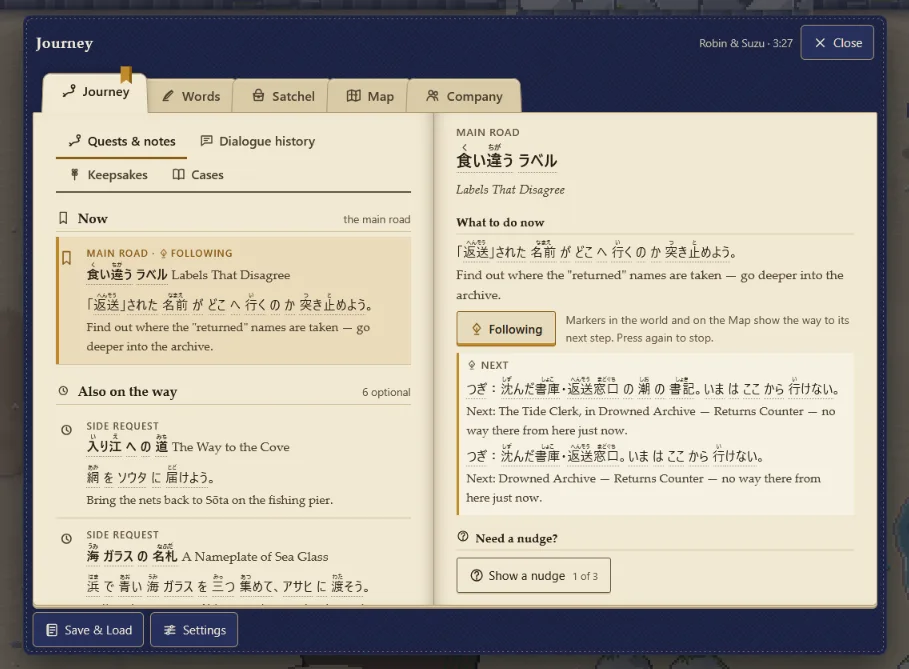
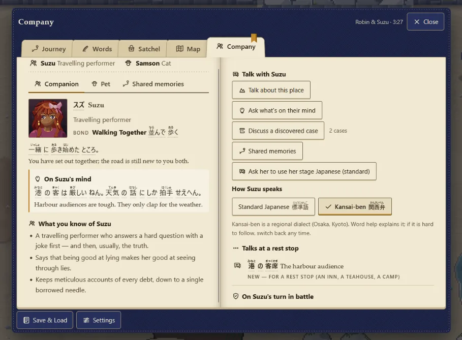

# The Road of Borrowed Names — UI direction supplement, v1.2

This text is integrated as §15A in the complete playbook. Read §00 there for C-72–74 approvals. It is not a standalone implementation authorization.

## 15A · An authored travel ledger: final interface direction

**Reading status.** Robin's latest direction is to remove the generic, nested-panel appearance and make the interface feel like a physical travel book within the game's 2.5D world. Robin also wants a deliberate English/Japanese typography treatment. Those are the requested outcomes. The construction, task boundaries and numeric starting values below are **implementation recommendations**, not claims about the current build or approval of a particular typeface. New-font use is now permitted subject to readability and fit with the game's tone. Apply them within the UI scope Robin authorizes. [DIRECTION: latest Journey/Company screenshots and accompanying feedback]

**The design sentence:** *Open a well-used, personally kept Wayfarer's Ledger: repaired indigo cloth, a believable spine and page stack, quiet ink typography, an amber place ribbon, and a few meaningful inserts. The object has depth; the words remain easy to read.*

The objective is an authored identity, not an “AI detector” or a blacklist of popular fonts. Rectangles, consistent alignment and accessible controls are not defects by themselves. The failure to avoid is making every subject look like the same bordered card inside the same software window. Replacing every card with a torn-paper card would repeat that failure in another material.

### UI-01 · Preserve the useful work; change its visual grammar

The two supplied screenshots already establish paper, cloth, a central fold, tabs and a distinction between overview and detail. Preserve their useful data, controls and task flows. Their repeated framing, dense control stacks and similar visual weight are the **baseline for revision**, not a claim that the implementation has no book-related work at all.

<figure class="ui-evidence"><figcaption><strong>Baseline A — Journey.</strong> User-supplied screenshot, cropped for inspection; not a new render or target mockup. Keep quest following, the next-step explanation and the nudge system. Make the itinerary, current action and optional work read as entries on a page rather than nested highlighted containers.</figcaption></figure>

<figure class="ui-evidence"><figcaption><strong>Baseline B — Company.</strong> User-supplied screenshot, cropped for inspection. Keep the companion, named pet, Bond description, thoughts, memory access and speech options. Give the portrait and the companion's own words the visual lead; do not replace the right-hand button stack with an equally repetitive stack of decorative slips.</figcaption></figure>

Before editing, list every visible control and its underlying action. Map old control to new location, label and keyboard/touch behavior. Retain the current data until a separately approved feature changes it. A visual redesign must not silently remove difficult-to-place actions, shorten important explanations, rewrite Suzu's personality, invent a numeric Bond meter, or add levels, currency or consumable stock.

### UI-02 · The physical object and its reading plane

Use four visual layers: **cover and ground shadow; page block and binding; readable leaves; occasional inserts and bookmarks**. The cover may be imperfect at the corners and the page block slightly offset. Wear is concentrated where a person would touch it, not sprayed as random noise across all surfaces. Use one coherent light direction for the cover, spine, page curl and insert shadows.

The opening motion may begin at a shallow oblique angle. As the book settles, the main reading surface becomes front-facing or nearly so. At rest, body text, furigana, form controls and the writing pad stay on an unskewed layout plane by default. Put most perspective into the cover silhouette, page edges, gutter and illustration planes. Do not tilt an entire existing modal and call the transformation finished.

A slightly raised portrait mounting, tucked map edge or folded hint insert can suggest depth without forcing every item to become a pop-up. A full dimensional reveal is reserved for an already-authored chapter/map/memory moment, never required to reach ordinary controls. It must not introduce a new game system or become a prerequisite for understanding the page.

**Proposed starting composition:** on a comfortably wide viewport, let the book occupy roughly 80–90% of usable width while maintaining readable line lengths and room for the cover. Treat this as a visual starting point, not a fixed pixel rule. On a narrow or short viewport, reduce ornament and switch to one reading leaf rather than scaling a two-page spread down until text becomes tiny. Book edges can leave the viewport when necessary; required content and controls cannot.

**Flat reading presentation:** provide an accessible flat treatment through the existing presentation/settings architecture. High-contrast and reduced-motion modes retain every action and section. A flat mode still has distinctive typography, chapter headings and page identity; it is not the discarded generic modal restored as a fallback.

### UI-03 · One navigation model, six recognizable sections

Preserve the agreed information architecture: **Journey, Words, Satchel, Map, Company and Distractions** in the Wayfarer's Ledger. Preserve the **Inn Ledger** as the six-save interface. Do not merge their storage semantics just because both look like books. [EP C-58; K10]

For the desktop proof, use one stable set of outward-facing fore-edge bookmarks, with horizontal labels and a clear selected marker. An amber place ribbon identifies the active section; keyboard focus is a separate visible mark. A compact tab treatment is acceptable when side bookmarks consume too much space. Choose one arrangement per layout mode, not simultaneous top, side and footer duplicates of the same navigation.

Inside a section, use a short contents list or ink subheading index for its subpages. On a wide screen, the index and the selected detail may share a spread; on a phone, opening a detail replaces the leaf and exposes a labelled Back action. Back returns to the prior selection and scroll position. Do not use a trail of new modal windows for each layer of detail.

Selecting a section, changing a selected row, following a quest, revealing a hint and starting a conversation are distinct actions. A page-turn effect does not imply that all of them should advance the book's page number. Search, filters and long lists retain practical controls where they already exist; they do not have to masquerade as physical tricks.

Keep Close, Back, Save & Load and Settings discoverable in consistent places. Illustrative bookmarks and decorative page corners are not the only way to activate essential navigation. Drag-to-turn, swiping and precise corner grabbing are never mandatory.

### UI-04 · Information hierarchy without repeated frames

Each spread should answer, in order: **Where am I? What am I looking at? What can I do here?** Use a section heading, a dominant subject and a compact action grouping. Separate adjacent topics with spacing, baseline alignment, one ink rule or a margin note before introducing another filled panel.

Use a small material vocabulary. Ordinary text belongs directly on the leaf. A slip means a detachable request, an inserted hint or a remembered note. A seal means an already-defined record, not a new reward. A folded map means a chart. A bookmark means navigation. Decorative flowers or fabric details have one restrained location and never imply that the player earned an item they do not own.

**Visible frame guideline:** normally one outer book silhouette, with shared paper leaves rather than frames around each subsection. An actual input field, important warning, selectable state or destructive confirmation may still need a boundary. Do not remove affordances simply to satisfy a rectangle count.

Asymmetry is editorial, not random: a portrait can offset the text on Company, and a folded map can occupy most of Map, while body text remains aligned. Never scatter labels, rotate paragraphs individually, randomize page furniture on each opening or make navigation depend on recognizing decorative objects.

### UI-05 · Journey: a working itinerary, not a task dashboard

**Left leaf:** current chapter/region heading; a ruled list of the main road and optional requests. The followed entry receives an amber ribbon edge and the word “Following.” Titles and concise next-action summaries should not all carry a full colored background. Preserve the distinction between active, finished, deferred and unavailable work.

**Right leaf:** selected quest title, one clear “What to do now” section, relevant location/route explanation, the follow/unfollow action and access to notes/history. The supplied quest can remain the inspection fixture; do not invent later-story content just to fill the page.

Turn “Need a nudge?” into a labelled fold-out advice insert within the same leaf. Activating it reveals the next authored hint, states how many have been revealed and retains previous hints for review. Its label, accessible state and focus behavior remain clear. A folded corner with no words is not sufficient.

Review repeated “Next” information against the actual guidance data. Present a destination and its reachability together; do not blindly delete two similar lines if they describe different route candidates. An unavailable route must still explain what is known and must not pretend to offer a walkable path.

Completed entries may move into the existing earlier/completed group, never vanish. Long quest titles, English translations and ruby annotations should wrap naturally. More space is earned by removing repetitive framing and redundant chrome, not by silently shrinking the reading text.

### UI-06 · Company: a shared journal, not a personnel dashboard

**Left leaf:** a larger, properly composed companion portrait or mounted painting; the companion's name and role; the existing textual Bond stage; their current thought as a short quotation in their own voice; and the known-details list. The portrait remains an illustration, not a literal modern photograph. Keep it recognizable at normal size and allow the existing expressive/animation system to operate without constant attention-seeking motion.

**Right leaf:** a short, clearly titled conversation index, followed by rest-stop topics and battle support information where appropriate. Group related talk actions as ink entries with comfortable hit areas instead of individual raised rectangles. The selected item can open an inline explanation or a detail leaf. Do not hide the action's availability reason inside hover-only text.

Show the active pet's given name and a small portrait in the Company index or page margin; its full entry remains its own subpage. Do not give it combat statistics or alter its cosmetic role. Shared memories remain distinct from the general travel volume and from unfinished story dialogue. [EP K10; existing Company data]

Keep speech/register settings readable and reversible. For Suzu, the current standard/Kansai choice belongs in a clearly labelled language note with real mutually exclusive controls. It is not a collectible tab, a skill upgrade or a Bond decision. Preserve the current dialogue-priority rules: opening Company or a pastime must not consume an important pending conversation.

Companion-specific marginal accents may refer to established identity—a quiet performer motif, courier note, apothecary label or lantern mark—but use the same control placement for every companion. Do not introduce newly invented thoughts or backstory merely to decorate the page.

### UI-07 · The remaining page families and dialogue

| Surface | Material and page identity | Required functional preservation |
| --- | --- | --- |
| Words | A clear study notebook: larger entry text, reading, examples, a quiet evidence margin and practice tools on the page. | Real Japanese text/ruby; separate input evidence; optional help; examples and accepted forms; existing practice modes. No fake handwritten body font. |
| Satchel | An equipment folio with an appearance study, labelled worn items and a few drawn loops/compartments. | Equipped state in words and shape; all existing equipment actions; no potion inventory, drag-only equip or hidden wearable choices. |
| Map | A fold-out field chart with legible annotations and routes. Its decorative folds avoid route labels and important nodes. | Real known/unknown/reachable states; existing navigation and quest markers; touch and keyboard alternative to map gestures. No invented connections. |
| Distractions | One illustrated activity page with its identity, how to play, location and personal records. | Its own top-level section; valid remote/venue-based launch rules; bounded Bond rules; no rehoming all games under Company. |
| Records / travel volume | Deliberate albums, specimen-like keepsakes and witnessed seals within Journey's existing hierarchy. | Viewing versus witnessing; spoiler veils; Continue appearance rules; no progress manufactured by an animation or opening a page. |
| Inn Ledger | A distinct registration book: six clearly numbered journeys, meaningful empty and incompatible states, named management actions. | Exactly six save slots; clear origin/destination for copy and New Game+; explicit overwrite/delete confirmation; no ornamental concealment of storage failure. |
| Title screen | The established environment and a deliberate title treatment, with the Inn Ledger as the way into saved journeys. | Continue/New Game/Load/Settings/About and current storage messaging; no new party slot, level counter or shop. |
| Dialogue / narration | A broad, quiet paper strip with one authored edge, an integrated speaker mark and restrained contextual accent. It belongs to the same material family without opening the entire book. | Speaker identity; existing Japanese/English hierarchy; ruby; word help; history; manual Next; keyboard/touch parity; no automatic advancement. |
| Battle / in-action speech | The same ink and paper language in compact intent slips, response controls and the temporary action banner. | HP/Harmony stay visible; response entry remains readable; action banner only during performance; blue party/red enemy origin with a text/shape cue; existing outcomes unchanged. |

Dialogue variations should share one layout and input model. Narration can have quieter edges and character speech a small signature accent, but do not build a different navigation pattern for each region or tone. A deliberately plain distress/confirmation treatment may override ornament when clarity matters.

Learning prompts and writing are functional surfaces, not set dressing. Keep handwriting coordinates, IME composition, text selection and word-help hit areas independent of book geometry. When a keyboard appears, prioritize the active entry and its confirmation controls; do not zoom out the entire book to keep a decorative cover visible.

### UI-08 · Motion that conveys a book, without making it slow

Use a small state machine for **closed → opening → reading → changing section → reading → closing**. Preserve the selected section and normal navigation state. Decorative animation never invokes gameplay actions or award logic.

**Proposed starting timings, to tune in the live proof:** opening 240–360 ms; section change 140–220 ms; closing 160–240 ms. They are design starting points, not measured requirements. The destination is committed once; a navigation input during motion should finish or supersede the decorative transition safely instead of being discarded or replayed against the new page.

Opening can lift the cover, expose the page block and settle the leaves. A section change can move a paper edge and ribbon; choosing a quest or talk topic uses a smaller change rather than a full book ceremony. No looping camera drift, page flutter, glow sweep or parallax response while the player is reading.

Reduced motion shows the destination directly or with a brief opacity change, without perspective travel. Disable nonessential motion when the setting changes mid-transition and preserve focus and state. Optional page sounds use the existing audio system, respect mute and never signal a required cue unavailable visually.

Keep lighting local to the object: subtle cover and page-edge response, a controlled gutter shadow and soft insert contact. Do not let world bloom, strong flicker or dynamic darkness wash across the text. Avoid an expensive live blur of the whole moving game behind every leaf; use the established scrim or a bounded approach measured in the proof. No new runtime library is implied.

### UI-09 · Typography: choose roles first, validate actual glyphs

**Do not assume a bespoke Japanese font already exists.** The supplied older HTML specifies a Latin serif stack, a Japanese Gothic/sans fallback stack and a system utility stack. A font-family list does not identify the actual font used for every glyph in Robin's current screenshots. Audit the current source and browser rendering before asserting which typeface is present. [BASELINE CODE: index(2)(1).html, styles/00_tokens.css and styles/10_legacy.css, lines 86–87 and 136–140]

Create five semantic roles, which may share families: **Latin display, Latin reading, utility controls, Japanese narrative headings, and Japanese learning/body/ruby**. “Five roles” does not mean five unrelated fonts. Prefer a small, coherent family pairing with deliberate sizes, weights, spacing and line lengths.

Explore a literary serif display treatment and a quieter reading face. Compare Japanese Mincho-style headings with a clear Gothic-style learning/body treatment, then compare a coherent Mincho reading option at actual sizes. These are directions to test, not a declaration that one classification is universally more readable. Do not force a distressed, brush, handwriting or pixel font onto kana, kanji, furigana or long text for novelty.

**Baseline text tests:** use actual long and short English/Japanese strings from the game, all supported punctuation, kana with dakuten/handakuten, small kana, dense kanji, names, digits and mixed-script lines. Include “I/l/1” and “O/0” on Latin specimens. Test ruby collision, fallback within a line, emphasis, line breaks, search/input text and the user's largest supported text setting. Preserve every kanji's required reading. Do not replace teaching glyph shapes with stylistic inventions.

Use the current project's reading and touch metrics as the minimum baseline. For the proof, start around 16 CSS px for ordinary reading text and evaluate larger Japanese text/ruby spacing as needed; do not treat this starting point as permission to reduce existing larger text. At 200% text scale or browser zoom, reflow and simplify decoration instead of clipping or hiding the current action. A decorative display heading may be unusual; the reading experience must remain dependable.

**Approved font policy.** Robin's latest decision permits a new font: “The new font can work as long as it's readable and stylized for the tone of the game.” This replaces the older font-file prohibition, not the offline/no-network rules. Keep paragraphs, controls and lessons as real text. No particular family is approved or supplied in this handoff.

**UI-TYPE-01 is approved in principle, subject to readability and tone.** Choose and verify the exact family, glyph coverage, offline embedding, licence/provenance, size impact and fallback behavior. Show actual English/Japanese text and furigana at normal and enlarged sizes within the existing U01/U02 visual review. Do not ask again for permission in principle or block independent layout work. Keep typography behind role tokens; no font has been selected or tested by this document.

### UI-10 · Single-model implementation sequence

One single-model owner implements these packets serially. Use existing project structures where they fit; the component names below are **responsibility names**, not a command to create a parallel framework. A UI packet includes state/interaction tests and rendered evidence, not only CSS.

| Packet / milestone | Deliverable | Exit evidence |
| --- | --- | --- |
| U00 / P00 | Reconcile approved C-72–74. Inventory screens, actions, strings, data sources, font stacks and current behavior. Record screenshot baselines and scope. | Old-to-new control map; no omitted action; confirmed decisions recorded; unchanged source snapshot retained. |
| U01 / P01 | One shared book shell, one reading plane, bookmark navigation, focus/scroll contract and flat treatment. Use current Journey and Company data. | Desktop and narrow proof, effects off/on; opening/change/close recording; no gameplay-state mutation from navigation. |
| U02 / P01 → P06 | Typography specimen and role tokens using a readable, tone-appropriate new font or permitted fallback. Establish reading sizes, ruby spacing and offline behavior. | Actual strings at normal/large text; selected-family and licence record; glyph/ruby checks; offline and fallback evidence on available platforms. |
| U03 / P06 | Finish Journey and Company end to end with the distinct page compositions in UI-05/06. | Follow/unfollow, hints, talk, memories, pet, language choice, unavailable actions and return paths all usable. |
| U04 / P06 | Transfer the shared shell to Words, Satchel, Map, Distractions, records and the Inn Ledger. | Screen/state census, six-slot behaviors, real data, no copied generic card layout passed off as page identity. |
| U05 / P06 → P16 | Bring dialogue, title, help, writing prompts, battle slips and confirmation surfaces into the same family. | Long dialogue, manual Next, help return, IME/keyboard, action visibility, keyboard/touch and safety confirmations. |
| U06 / P16 | Complete authored ornament, book materials and transitions across every old/new page. Remove obsolete UI code after parity is proven. | All required states at the accepted finish; no legacy screen left in an abandoned skin; no duplicate navigation implementation. |
| U07 / P17 | Close cross-language, accessibility, input, offline and performance checks; obtain visual disposition. | Full UI evidence index and remaining issues; final game matrix/publication still only at P18's explicit gate. |

Suggested shared responsibilities: **BookShell** (cover/depth), **ReadingLeaf** (real text/layout), **BookmarkNav** (navigation), **SectionIndex** (subpages), **EntryList** (long records), **DetailLeaf** (selected item), **MarginalNote** (supplement), **ActionRow** (semantic controls), **DialogueStrip**, **ConfirmSheet**, and **TypeRoles**. Keep state and DOM order clear when the visual arrangement changes. Avoid a master “Card” component that makes every screen identical.

Keep animation and decoration separate from semantic hit targets. Decorative elements cannot intercept input. Reuse stable IDs for controls and preserve event ownership. Reflow should not recreate a control in a way that commits its action again. Test resizing during a page transition and closing during hint/conversation navigation.

Prepare screen/state fixtures and deterministic decoration, so before/after captures compare the same data. Keep source modular and build the single-file artifact through the existing pipeline; do not edit generated index.html as the only source of a fix. UI-only revisions do not need a new save format, new remote service or new runtime library.

### UI-11 · Acceptance checklist and required evidence

The checklist below is a **new visual/interaction requirement register**, separate from the 118 expansion features. Proposed implementation status begins as **not implemented / not tested by this document**. A passed screenshot check is not a passed interaction test, and an automated pass is not Robin's visual approval.

| ID | Acceptance requirement | Evidence that closes it |
| --- | --- | --- |
| UI-A01 | The ledger reads as one physical, authored object rather than nested application panels. | Journey/Company captures with textures and shadows both on and off; Robin's visual review. |
| UI-A02 | Shape and depth never compromise the reading plane. | Normal/large text and flat mode; no skewed ruby or clipped body text. |
| UI-A03 | Page families are distinct without arbitrary navigation. | Six sections plus Inn Ledger and dialogue shown together with a control map. |
| UI-A04 | Every existing and approved action remains reachable. | Old-to-new control inventory and focused mouse, keyboard and touch checks. |
| UI-A05 | Follow, selection, focus, availability and danger are distinguishable without color alone. | State captures, keyboard traversal and high-contrast checks. |
| UI-A06 | Journey preserves destination, route explanation and hint progression. | Current/unreachable/completed fixtures; hint reveal counts and no accidental repeats. |
| UI-A07 | Company preserves the chosen companion, given pet name, Bond text, thoughts and speech settings. | All four companion fixtures; pet absent/present; pending-story and unavailable-topic states. |
| UI-A08 | Distractions remains its own section and obeys venue/companion launch rules. | Safe start/return and story-priority fixtures; no remote physical game introduced. |
| UI-A09 | The Inn Ledger stays a six-save interface with honest storage/edition states. | Zero/one/six saves; incompatible save; copy/overwrite/delete and storage-refusal tests. |
| UI-A10 | Japanese, furigana and mixed-script text stay correct and legible. | Actual-font audit and glyph specimens; long strings; no missing glyph or ruby overlap. |
| UI-A11 | Typography meets the approved readability, tone and offline requirements. | New-font permission recorded; exact family/licence, readable specimens, glyph/ruby coverage, fallback and offline report. |
| UI-A12 | Page motion cannot alter results or lose navigation input. | Transition interruption, repeated inputs, resize and reduced-motion changes; event-count assertions. |
| UI-A13 | Dialogue remains manually advanced and available without a pointer. | Click/tap/key Next; history/help open and return; long lines and speaker identity. |
| UI-A14 | Writing and typing remain independent of decorative book geometry. | Handwriting hit coordinates; IME composition; keyboard occlusion; confirm/cancel at large text. |
| UI-A15 | Compact layout is a real reflow, not a shrunken desktop screenshot. | 320×640 and 375×667 CSS-pixel fixtures plus short landscape and foldable checks. |
| UI-A16 | Battle identity and learning controls remain intact. | Decision/action/entry states; two-person HP/Harmony; temporary banner; Suzu cut-in; crowded layout. |
| UI-A17 | Old and new screens share the finished treatment. | Complete screen/state census, including empty/error/long-content/settings/help states. |
| UI-A18 | The finished book remains quick and usable. | Cold/warm menu-open, frame/stall/cache measures on actual tested devices, compared with baseline. |
| UI-A19 | Presentation cannot fabricate progress or expose hidden story content. | State hashes around browsing/replay; spoiler veils; no false stamp/Bond/record award. |
| UI-A20 | The pass is visually accepted, not merely declared complete by its author. | A concise review set and explicit accepted/revise disposition for the remaining artistic issues. |

**Minimum inspection set:** supplied Journey and Company states before/after; Words with a dense ruby example; Satchel with an equipped item; Map with an annotation; one real Distractions page; Inn Ledger empty/occupied/incompatible; dialogue with choices and help; and battle decision/action states. These are a representative review set, not a substitute for the complete screen/state census.

Capture wide desktop, 1440×900, 320×640, 375×667, short landscape and the foldable's actual viewport when available; record CSS viewport, device pixel ratio, text setting, browser, build revision and selected font evidence. Combine representative stress fixtures rather than running every story route for each style adjustment. Unavailable platform checks remain marked untested. Keep the existing F/Ren milestone cadence; run the full 16-route campaign matrix only when Robin asks.

Show the same content with effects off: hierarchy must still work without glow, paper grain, shadows, sound or portrait motion. Then inspect normal-speed opening, section changes, help, writing and closing. Compare against the supplied screenshots for controls and against this section for direction. Do not claim that a newly generated concept sheet proves any of those interactions.

### UI-12 · Review gates, handoff and scope boundaries

Ask Robin to judge one coherent proof set at U01/U02: **Journey, Company, a dialogue strip and a narrow reading layout**, plus the typography specimen. The focused question is whether it feels like a book belonging to this journey while remaining easy to use. Avoid dozens of disconnected variants or a vote between font names without real text.

Once the method is accepted, apply it through U03–U06 without reopening its core decisions for each page. Review meaningful exceptions; keep independent authorized content work moving. A failed material or readability test requires correcting its shared cause, not piling on decorative assets. Reserve final comprehensive visual coverage for P16/P17.

Each handoff lists: packet and requirement IDs; affected controls/screens; build and source revision; decisions used; measured versus untested claims; normal and flat/reduced-motion captures; interaction test results; current font-policy status; remaining problems; and the next operation. Use the package's UI acceptance template rather than inventing a fresh report format every time.

**What this section does not authorize:** a new game economy, different companion canon, removal of accessibility controls, account/cloud features, remote fonts, a rendering-engine migration, global implementation outside Robin's scope, a premature full campaign matrix or publication. It deepens V10 and K10's presentation work, not the game's rules.

**Source anchors:** Robin's latest UI feedback and two screenshots; EP C-58, C-16, K10 and technical boundaries; playbook §§11, 15/V10, 17 and P01/P06/P16/P17; the supplied older HTML font and folio styles. Screenshot observations are not a fresh repository audit. New-font use is permitted; no particular external family or licence has been selected or verified in this amendment.
